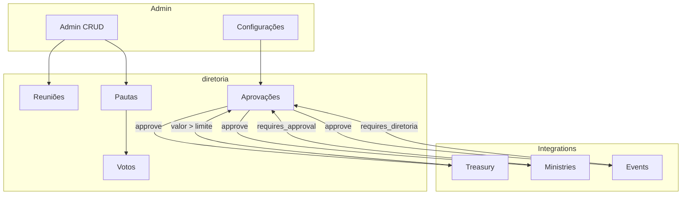

# Diretoria Baptist Upgrade

Plano completo de melhoria, refinamento e integração do módulo Diretoria para alinhar com o modelo congregacional batista (liderancaes, diáconos, assembleia de membros, ministérios/comissões), corrigir bugs existentes, implementar integrações com Treasury, Ministries e Events, e garantir coerência frontend-backend em todo o sistema.

# Plano de Melhoria e Refinamento do Módulo Diretoria (Modelo Batista)

## Contexto Batista (CBB)

Com base nos [Princípios Batistas da CBB](https://www.convencaobatista.com.br/site/pagina.php?MEN_ID=21) e na estrutura congregacional:

- **liderancaes/Ministros**: Pregação, ensino e cuidado liderancaal
- **Diáconos**: Serviço prático e assistência aos membros
- **Assembleia de Membros**: Decisões importantes submetidas à votação da igreja
- **Ministérios/Comissões**: Missões, Educação Religiosa, Ação Social
- **Governo congregacional**: Soberania na assembleia; autonomia local; cooperação

---

## 1. Correções Críticas (Bugs Existentes)

### 1.1 diretoriaApproval - Polimorfismo Quebrado

**Problema**: [diretoriaController::submitApprovalRequest](../../../../../Users/Administrator/.cursor/plans/Modules/Diretoria/app/Http/Controllers/MemberPanel/diretoriaController.php) cria `diretoriaApproval` com `approvable_type => null` e `approvable_id => null`, mas a migration exige ambos NOT NULL.

**Solução**: Tornar `approvable_type` e `approvable_id` nullable na migration (nova migration de alteração). Para solicitações genéricas (sem entidade vinculada), permitir null. Ajustar `diretoriaApproval::executeApproval()` para checar `approvable` antes de executar.

### 1.2 diretoriaApproval::executeApproval - Modelo Errado

**Problema**: Referencia `Modules\HomePage\App\Models\Event`; o sistema usa `Modules\Events\App\Models\Event` para eventos.

**Solução**: Corrigir para `Modules\Events\App\Models\Event` e adicionar branch para `Modules\Treasury\App\Models\FinancialEntry` e `Modules\Ministries\App\Models\Ministry` quando as integrações forem implementadas.

### 1.3 DiretoriaDatabaseSeeder

**Problema**: Usa `start_date` em vez de `term_start`; `term_end` não definido.

**Solução**: Corrigir para `term_start` e `term_end`; adicionar role `deacon` nos exemplos.

### 1.4 Settings - updateSettings Não Persiste

**Problema**: [diretoriaController::updateSettings](../../../../../Users/Administrator/.cursor/plans/Modules/Diretoria/app/Http/Controllers/Admin/diretoriaController.php) retorna JSON sem salvar em `Settings`.

**Solução**: Implementar persistência via `Settings::set()` para cada chave (`jubaf_diretoria_name`, `jubaf_diretoria_meeting_frequency`, etc.). Ajustar rota para aceitar POST (form já envia POST com `@method('PUT')` — usar `Route::match(['post','put'], ...)`).

---

## 2. Modelo Batista - Papéis e Estrutura

### 2.1 Adicionar Role "Diácono"

**Arquivos**: [diretoriaMember](../../../../../Users/Administrator/.cursor/plans/Modules/Diretoria/app/Models/diretoriaMember.php), migration `diretoria_members`.

**Alterações**:

- Nova migration: adicionar `deacon` ao enum `diretoria_role` (ou alterar para string se enum for restritivo).
- Constante `ROLE_DEACON = 'deacon'` em diretoriaMember.
- `getRoleDisplayName()`: `'deacon' => 'Diácono'`.
- Seeder: incluir exemplo de diácono.

### 2.2 Distinção Conselho x Assembleia (Opcional Fase 2)

Para decisões que exigem votação da assembleia (ex.: orçamento anual, mudança de estatuto):

- Novo tipo de reunião: `TYPE_ASSEMBLY = 'assembly'` em diretoriaMeeting.
- Nova tabela `diretoria_assembly_votes` (opcional): `user_id`, `agenda_id`, `vote`, `voted_at` — permite que membros da igreja (não só conselho) votem em pautas marcadas como "assembleia".
- Flag em diretoriaAgenda: `requires_assembly_vote` (boolean) — quando true, decisão depende da assembleia.

**Escopo**: Pode ser fase 2; na fase 1, manter apenas conselho votando.

---

## 3. Integração com Módulos

### 3.1 Treasury

**Fluxo**: Despesas acima de um limite configurável exigem aprovação do conselho antes de serem efetivadas.

- **diretoriaApproval**: `TYPE_FINANCIAL_REQUEST` já existe; implementar `executeApproval` para criar/liberar `FinancialEntry` ou marcar como aprovado.
- **Treasury**: Adicionar campo `diretoria_approval_id` (nullable) em `financial_entries` ou criar tabela de vínculo. Quando valor > `jubaf_diretoria_auto_approve_budget_limit`, criar `diretoriaApproval` e bloquear a entrada até aprovação.
- **Listener ou Service**: Ao criar `FinancialEntry` com valor acima do limite, criar `diretoriaApproval` com `approvable_type => FinancialEntry::class`, `approval_type => financial_request`.

### 3.2 Ministries

**Fluxo**: Ministérios com `requires_approval` geram `diretoriaApproval` ao adicionar membro.

- **Ministries**: Ao adicionar membro em ministério com `requires_approval`, criar `diretoriaApproval` com `approvable_type => Ministry::class` (ou pivot `ministry_members`), `approval_type => ministry_membership`.
- **diretoriaApproval::executeApproval**: Para `ministry_membership`, atualizar pivot `ministry_members` (status `pending` → `active`, `approved_by`, `approved_at`).

### 3.3 Events

**Fluxo**: Eventos podem exigir aprovação do conselho antes de publicação.

- **Events**: Campo opcional `requires_diretoria_approval` em Event. Se true, ao criar/editar, criar `diretoriaApproval` com `approvable_type => Modules\Events\App\Models\Event`, `approval_type => event_creation`.
- **diretoriaApproval::executeApproval**: Para `event_creation`, usar `Modules\Events\App\Models\Event` e marcar como publicado/ativo.

### 3.4 diretoriaProject - Vínculo com Ministry

**Arquivos**: [diretoriaProject](../../../../../Users/Administrator/.cursor/plans/Modules/Diretoria/app/Models/diretoriaProject.php), migration.

**Alterações**:

- Nova coluna `ministry_id` (nullable, FK para `ministries`).
- Relação `diretoriaProject::ministry()` → `Ministry`.
- Formulários create/edit: dropdown de Ministérios (via API ou lista do módulo Ministries).
- Admin e MemberPanel: exibir ministério no projeto.

---

## 4. API v1 - Expansão

**Arquivo**: [DiretoriaApiService](../../../../../Users/Administrator/.cursor/plans/Modules/Diretoria/app/Services/DiretoriaApiService.php), [DiretoriaController](../../../../../Users/Administrator/.cursor/plans/Modules/Diretoria/app/Http/Controllers/Api/V1/DiretoriaController.php).

**Endpoints adicionais** (formato `{ data }`):

| Método | Endpoint                                     | Descrição                                    |
| ------ | -------------------------------------------- | -------------------------------------------- |
| GET    | `/api/v1/church-diretoria/members`           | Lista membros ativos                         |
| GET    | `/api/v1/church-diretoria/agendas`           | Lista pautas (filtro por meeting_id, status) |
| GET    | `/api/v1/church-diretoria/agendas/{id}`      | Detalhe da pauta com votos                   |
| POST   | `/api/v1/church-diretoria/agendas/{id}/vote` | Registrar voto (member panel)                |
| GET    | `/api/v1/church-diretoria/approvals`         | Lista aprovações (filtro status)             |
| GET    | `/api/v1/church-diretoria/documents`         | Lista documentos ativos                      |
| GET    | `/api/v1/church-diretoria/projects`          | Lista projetos                               |

Registrar em [routes/api.php](../../../../../Users/Administrator/.cursor/plans/routes/api.php) no grupo `v1/church-diretoria`.

---

## 5. Permissões e Acesso

### 5.1 Admin x diretoria Member

- **Admin**: Acesso total ao CRUD (membros, reuniões, pautas, aprovações, documentos, projetos, configurações). Aprovar/rejeitar exige que o usuário seja `diretoriaMember` — admins que não são do conselho não podem aprovar.
- **Fallback**: Se a igreja não tiver conselho formal, permitir que admins com role `lideranca` ou `admin` aprovem mesmo sem `diretoriaMember` (configurável em Settings: `jubaf_diretoria_allow_admin_approval`).

### 5.2 MemberPanel - Quem Vê o Conselho

- Sidebar: link "Conselho" só para `auth()->user()->diretoriaMember` (já implementado).
- Middleware: validar `diretoriaMember` e `isActive()` em todas as rotas do painel do conselho (já feito no controller).

---

## 6. Documentos e Tipos (CBB)

**Arquivo**: [diretoriaDocument](../../../../../Users/Administrator/.cursor/plans/Modules/Diretoria/app/Models/diretoriaDocument.php).

**Tipos adicionais** (opcional, alinhado à CBB):

- `declaracao_doutrinaria` — Declaração Doutrinária
- `pacto_igrejas` — Pacto das Igrejas Batistas
- `regimento_interno` — Regimento Interno (já existe `regiment`)

Adicionar constantes e labels em i18n.

---

## 7. Notificações

Usar **InAppNotificationService** (AGENTS.md):

- Nova reunião agendada → notificar membros do conselho.
- Nova pauta pendente → notificar presidente/secretário.
- Nova solicitação de aprovação → notificar membros com permissão.
- Lembrete 24h antes da reunião (se `reminder_notifications` ativo).

---

## 8. i18n e UX

- Completar [messages.php](../../../../../Users/Administrator/.cursor/plans/Modules/Diretoria/lang/pt_BR/messages.php) para todas as novas chaves.
- Garantir `<x-loading-overlay />` em submits (forms já devem disparar).
- Padronizar ícones: `<x-icon name="..." />` (Font Awesome 7.1 Pro Duotone).
- Revisar textos para linguagem batista (ex.: "Conselho da Igreja", "Assembleia").

---

## 9. Fluxo de Dados (Resumo)

---

## 10. Ordem de Implementação Sugerida

1. **Correções críticas** (1.1–1.4): Approval nullable, executeApproval, Seeder, Settings.
2. **Role Diácono** (2.1): Migration + model + seeder.
3. **diretoriaProject + Ministry** (3.4): ministry_id, formulários.
4. **Settings persist** (1.4): updateSettings com Settings::set.
5. **Integrações** (3.1–3.3): Treasury, Ministries, Events — criar diretoriaApproval nos fluxos e implementar executeApproval.
6. **API v1** (4): Novos endpoints.
7. **Notificações** (7): InAppNotificationService.
8. **Documentos CBB** (6) e **Assembleia** (2.2) — opcional.

---

## Arquivos Principais a Modificar

| Módulo      | Arquivos                                                                                                                                                                                                                        |
| ----------- | ------------------------------------------------------------------------------------------------------------------------------------------------------------------------------------------------------------------------------- |
| Diretoria   | `diretoriaMember`, `diretoriaApproval`, `diretoriaProject`, `diretoriaController` (Admin/MemberPanel), `DiretoriaApiService`, `DiretoriaController` (API), `DiretoriaDatabaseSeeder`, migrations, `messages.php`, settings view |
| Treasury    | `FinancialEntry` (migration), service/listener para criar diretoriaApproval                                                                                                                                                     |
| Ministries  | Service ao adicionar membro com requires_approval                                                                                                                                                                               |
| Events      | Opcional: flag + diretoriaApproval                                                                                                                                                                                              |
| Admin       | Sidebar já OK                                                                                                                                                                                                                   |
| MemberPanel | Sidebar já OK                                                                                                                                                                                                                   |
