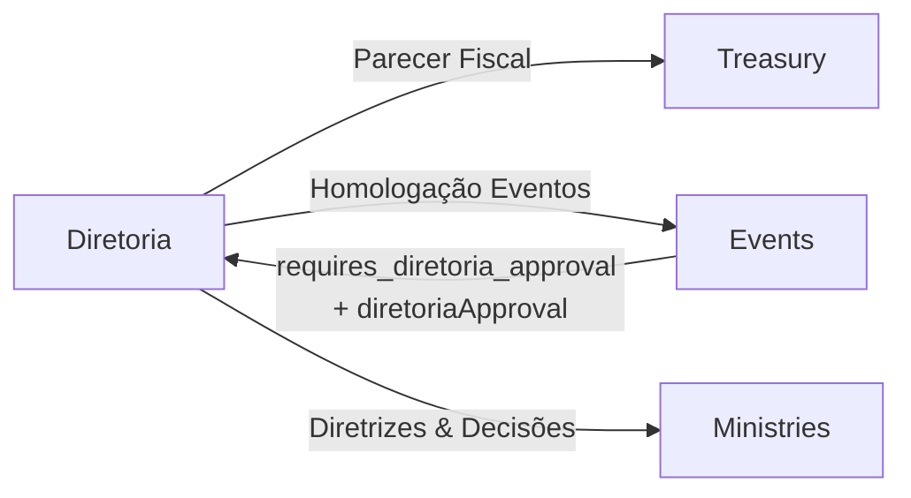

# final-bridge-diretoria-integrations

overview: Conectar o módulo Diretoria com Tesouraria, Ministérios/Events e reforçar a segurança/assinatura digital, consolidando o conselho como hub de governança batista.
todos:

- id: treasury-fiscal-opinion
  content: Adicionar fechamentos mensais na Tesouraria e fluxo de Parecer Fiscal do conselho com flag ready_for_assembly.
  status: pending
- id: events-planning-homologation
  content: Ajustar fluxo de aprovação de eventos (status waiting_approval) e criar painel de Homologação de Planejamento no Diretoria.
  status: pending
- id: minutes-digital-signatures
  content: Criar minutes_signatures e fluxo de visto digital nas atas, integrando com o PDF final.
  status: pending
- id: discipline-files-security
  content: Configurar disco protegido e mover anexos de disciplina para storage não público, mantendo editais de convocação públicos.
  status: pending
- id: diretoria-touchpoints-review
  content: Revisar todos os 19 módulos para mapear e documentar pontos de contato atuais e potenciais com o conselho.
  status: pending
  isProject: false

---

# Final Bridge – Integrações Diretoria (Tesouraria, Ministérios, Eventos)

## Visão geral

- **Objetivo**: completar as integrações entre `Diretoria` e os demais módulos para que o conselho seja o hub de governança: parecer fiscal, homologação de planejamento (eventos/ministérios), visto digital em atas e endurecimento da segurança de arquivos.
- **Abordagem**: aproveitar padrões já existentes (API v1 da Tesouraria, `diretoriaApproval`, `diretoriaAuditService`, `InAppNotificationService`) e acrescentar apenas o mínimo de novas tabelas/campos necessários, mantendo o desenho modular.

## Arquitetura de alto nível

- **Diretoria** continua orquestrando: decisões, atas, disciplina, transferências e agora pareceres fiscais + homologação de planejamento.
- **Treasury** permanece como fonte de verdade financeira; o conselho apenas adiciona o carimbo `ready_for_assembly` para balancetes fechados.
- **Events/Ministries** continuam responsáveis pelo ciclo de vida operacional; o conselho faz gatekeeping em eventos que afetam planejamento ministerial/calendário.

## 1. Integração com Tesouraria – Parecer Fiscal

**Objetivo**: permitir que o conselho dê um "ok" formal sobre fechamentos mensais, marcando-os como `ready_for_assembly`.

1. **Modelo de fechamento mensal na Tesouraria**

- Criar uma nova tabela em Treasury, por exemplo `treasury_monthly_closings`, com colunas:
    - `id`, `year`, `month`, `period_start`, `period_end`.
    - `total_income`, `total_expense`, `balance` (snapshot dos agregados usados em `getReportAggregates`).
    - `ready_for_assembly` (boolean), `diretoria_approved_at` (datetime), `diretoria_approved_by` (user_id opcional), `notes` (texto curto).
- Criar o modelo `TreasuryMonthlyClosing` em `Modules/Treasury/app/Models/TreasuryMonthlyClosing.php` com escopos auxiliares (`forPeriod`, `readyForAssembly`).

2. **Serviço & API da Tesouraria**

- Estender `TreasuryApiService` (`Modules/Treasury/App/Services/TreasuryApiService.php`) com métodos:
    - `getOrCreateMonthlyClosing(string $startDate, string $endDate, User $user): TreasuryMonthlyClosing` (calcula `year`, `month`, chama `getReportAggregates` e persiste snapshot).
    - `markClosingReadyForAssembly(TreasuryMonthlyClosing $closing, User $user, ?string $notes = null)`.
- Expor endpoints API v1 em `TreasuryController` (`/api/v1/treasury/closings` e `/closings/{id}/approve-for-assembly`), retornando `{ data: { ...closing } }`.

3. **Integração na UI de Relatórios Financeiros (Tesouraria)**

- Em `ReportController@index` (`Modules/Treasury/app/Http/Controllers/Admin/ReportController.php`):
    - Após obter `$data`, chamar o serviço para recuperar (sem criar ainda) ou pré-carregar um `TreasuryMonthlyClosing` para o período selecionado, quando o intervalo corresponder exatamente a um mês fechado (já há lógica semelhante em `exportPdf` para distinguir balancete mensal).
    - Passar para a view: `monthlyClosing` (ou `null`) e `candiretoriaApprove` (true se o usuário atual for um `diretoriaMember` ativo ou lideranca/admin com permissão, seguindo o padrão usado em `Diretoria` para `allow_admin_approval`).
- Em `[Modules/Treasury/resources/views/admin/reports/index.blade.php](Modules/Treasury/resources/views/admin/reports/index.blade.php)`:
    - Adicionar, próximo dos botões de exportação, um cartão/ botão **"Parecer Fiscal do Conselho"** que:
        - Mostra o estado atual (`Aguardando parecer`, `Aprovado para assembleia em dd/mm/aaaa`).
        - Renderiza o botão **"Aprovar para Assembleia"** apenas quando:
            - `candiretoriaApprove === true`,
            - intervalo representa um mês completo,
            - `monthlyClosing->ready_for_assembly === false`.
        - Ao clicar, faz `POST` via `fetch` para uma rota interna da Tesouraria (por exemplo `treasury.reports.diretoria-approve`), que delega para `TreasuryApiService::markClosingReadyForAssembly(...)`.

4. **Ligação com Diretoria (opcionalmente via diretoriaApproval)**

- Para manter trilha de governança consistente:
    - Adicionar um novo tipo em `diretoriaApproval` (`TYPE_TREASURY_MONTHLY_REPORT`).
    - Ao aprovar o fechamento na rota Tesouraria, opcionalmente criar um `diretoriaApproval` já com status `approved`, apontando para o `TreasuryMonthlyClosing` (polimórfico), ou registrar apenas em `diretoriaAuditService` (mais simples).
- Independentemente de `diretoriaApproval`, registrar auditoria via `diretoriaAuditService` usando `action = 'treasury_closing_ready_for_assembly'` com payload do período/valores.

5. **Notificações**

- Ao marcar `ready_for_assembly`, disparar via `InAppNotificationService` uma notificação para admins/liderancaes e, se desejado, para membros da assembleia com permissão de ver relatórios, indicando que o **balancete mensal X/Y está pronto para assembleia**.

## 2. Integração com Ministérios e Eventos – Painel de Homologação

**Objetivo**: formalizar a fila de eventos que dependem de aval do conselho, com um painel de homologação e mudança automática para `published`/ativo.

1. **Status `waiting_approval` em Events**

- Atualizar a enum `events.status` via nova migração (mantendo compatibilidade), adicionando o valor `waiting_approval` (sem alterar o default).
- Atualizar o modelo `Event` (`Modules/Events/app/Models/Event.php`):
    - Adicionar constante `STATUS_WAITING_APPROVAL`.
    - Incluir esse status em `getStatusDisplayAttribute` (ex.: "Aguardando Conselho").
    - Garantir que filtros de listagem no admin tratem esse status como não-publicado (somente `STATUS_PUBLISHED` continua indo para público/member).

2. **Reuso de diretoriaApproval já existente**

- Já existe integração para `requires_diretoria_approval` em `EventController@store` e `@update` criando `diretoriaApproval::TYPE_EVENT_CREATION` e regredindo status para `draft`.
- Ajustar essa lógica para, em vez de `draft`, setar `status = STATUS_WAITING_APPROVAL` quando o evento requerer conselho e for marcado como `published`.
- Manter `diretoriaApproval::executeApproval` como hoje, garantindo que, ao aprovar, o status do evento seja atualizado para `STATUS_PUBLISHED` (ativo) – já alinhado ao requisito "active ou published".

3. **Painel de Homologação no Diretoria**

- Criar uma nova action no `diretoriaController` admin (`Modules/Diretoria/app/Http/Controllers/Admin/diretoriaController.php`), algo como `planningApprovals()`, que:
    - Busca `diretoriaApproval` com `approval_type = TYPE_EVENT_CREATION` e `status IN (pending, requires_revision)`.
    - Eager-load `approvable` (evento) e seu `ministry` para permitir filtros por ministério/setor.
    - Opcionalmente restringe a eventos cujo `Event::status === STATUS_WAITING_APPROVAL` para deixar a UI coerente com o texto do requisito.
- View em `[Modules/Diretoria/resources/views/admin/planning/index.blade.php](Modules/Diretoria/resources/views/admin/planning/index.blade.php)`:
    - Lista cards/linhas com: título do evento, ministério ligado, datas, responsável, status atual.
    - Botões "Aprovar" / "Rejeitar" reutilizando as rotas `approveRequest`/`rejectRequest` já existentes no `diretoriaController` (via AJAX), filtradas para `TYPE_EVENT_CREATION`.

4. **Integração visual com Ministérios**

- Na tela de detalhes do evento (`events::admin.events.show`), destacar quando `requires_diretoria_approval` estiver ativo e o evento estiver `waiting_approval`, mostrando um selo "Aguardando homologação do conselho" ao lado do ministério associado.
- Opcionalmente, no módulo `Ministries`, em um dashboard de planejamento (se existir), mostrar os eventos do ministério com status `waiting_approval` (consulta simples à tabela de eventos), reforçando que ainda não foram homologados.

5. **Auditoria e notificações**

- Em `diretoriaApprovalObserver` já há notificações para novas solicitações; o painel só organiza a fila.
- Garantir auditoria via `diretoriaAuditService` quando um `diretoriaApproval` de evento for aprovado/rejeitado (já em parte feito na fase anterior, apenas reforçar para o tipo `TYPE_EVENT_CREATION`).

## 3. Visto Digital em Atas (minutes_signatures)

**Objetivo**: permitir que membros do conselho deem um "visto digital" em versões específicas da ata, registrando quem concorda com o texto final.

1. **Nova tabela e modelo de assinatura de atas**

- Criar migração `meeting_minutes_signatures` com colunas:
    - `id`, `minutes_version_id` (FK para `meeting_minutes_versions`), `user_id` (FK `users`), `signed_at` (datetime), timestamps padrões.
    - Índice único em (`minutes_version_id`, `user_id`) para evitar duplicidade de visto.
- Criar `MeetingMinutesSignature` em `Modules/Diretoria/app/Models/MeetingMinutesSignature.php` com `belongsTo` para `MeetingMinutesVersion` e `User`.
- Adicionar relação `signatures()` em `MeetingMinutesVersion` e helper `signedBy(User $user): bool`.

2. **Fluxo de assinatura no painel do conselho**

- Na tela de detalhes da reunião `[Modules/Diretoria/resources/views/admin/meetings/show.blade.php](Modules/Diretoria/resources/views/admin/meetings/show.blade.php)`:
    - Identificar a versão relevante da ata para assinatura (tipicamente a última com `state = 'diretoria_approved'` ou `state = 'assembly_approved'`).
    - Exibir um bloco "Visto digital" com:
        - Lista de nomes de quem já assinou a versão atual.
        - Um botão **"Dar Visto na Ata"** visível apenas para usuários com `diretoriaMember` ativo que ainda não assinaram essa versão.
- Expor uma rota POST (ex.: `admin.Diretoria.meetings.minutes-signatures.store`) que:
    - Valida autenticação e que o usuário é membro do conselho.
    - Localiza a `MeetingMinutesVersion` alvo (por ID ou implicitamente a versão corrente) e cria `MeetingMinutesSignature` com `signed_at = now()`.
    - Registra auditoria via `diretoriaAuditService` com `action = 'minutes_signed'`.

3. **Reflexo no PDF da Ata**

- Ajustar o controller responsável por `exportMinutesPdf` (em `diretoriaDocumentController`) para enviar à view `minutes.blade.php` a lista de assinaturas da versão mais recente (por ex. `$latestMinutes->signatures`).
- Em `[Modules/Diretoria/resources/views/admin/pdf/minutes.blade.php](Modules/Diretoria/resources/views/admin/pdf/minutes.blade.php)`:
    - Manter as duas linhas institucionais (Secretário / Presidente) como hoje.
    - Adicionar, no rodapé, um bloco de texto discreto listando: "Visto digital por: Nome1, Nome2, ..." usando os `signatures` da versão selecionada.
- Garantir que nenhuma lógica de renderização dependa de assets externos (mantendo compatibilidade com `PdfService`).

4. **Notificações**

- Opcional: ao atingir um certo quorum de vistos (ex.: maioria simples dos conselheiros cadastrados), enviar uma notificação via `InAppNotificationService` aos admins/liderancaes informando que a ata está "amplamente visada".

## 4. Segurança de Arquivos – Casos Disciplinares vs. Editais

**Objetivo**: segregar completamente anexos sensíveis de disciplina em storage protegido, mantendo editais e convocatórias acessíveis ao público quando necessário.

1. **Configuração de disco protegido**

- Em `config/filesystems.php`, definir um novo disco `protected` apontando para `storage/app/protected` (sem symlink para `public/storage`).
- Criar uma rota/controller genérico para download protegido que:
    - Exija autenticação e autorização (ex.: apenas `diretoriaMember`, liderancaes, admins, ou usuários diretamente envolvidos).
    - Use `Storage::disk('protected')->download($path, $filename)`.

2. **Anexos em Casos Disciplinares**

- Estender o domínio de disciplina (`DisciplineCase` / `DisciplineAction`) para suportar anexos (por exemplo, nova tabela `discipline_case_files` com `discipline_case_id`, `path`, `original_name`, `mime_type`, `size`, `uploaded_by`).
- No controller de disciplina (`Modules/Diretoria/app/Http/Controllers/Admin/DisciplineController.php`) e nas views `create/show`:
    - Adicionar campos de upload de documento.
    - Armazenar sempre no disco `protected` (ex.: `Storage::disk('protected')->putFile('Diretoria/discipline', $file)`), nunca no disco `public`.
    - Expor links de download que apontem para a rota protegida, não para URLs públicas.

3. **Editais de Convocação (públicos)**

- Revisar a geração de PDFs de convocação (`diretoriaDocumentController@exportConvocationPdf` e `[Modules/Diretoria/resources/views/admin/pdf/convocation.blade.php](Modules/Diretoria/resources/views/admin/pdf/convocation.blade.php)`):
    - A geração on-the-fly (stream) está OK e já é segura.
    - Se houver persistência de arquivos (ex.: histórico de editais), continuar usando o disco `public` ou um endpoint público controlado, pois o requisito diz que eles podem ser públicos.
- Garantir que nenhum arquivo de disciplina use o mesmo diretório/nomeclatura que convocação para evitar confusão.

4. **Auditoria e revisões rápidas**

- Em quaisquer novos uploads sensíveis (disciplina), registrar via `diretoriaAuditService` (`action = 'discipline_file_uploaded'`) com tamanho/nome originais no payload.
- Opcional: rodar um script de verificação (tarefa artisan) que varre o disco `public` em busca de paths que contenham palavras-chave de disciplina e alerta via `InAppNotificationService` caso existam arquivos pré-existentes fora do padrão.

## 5. Revisão de pontos de contato com os 19 módulos

**Objetivo**: garantir que todo módulo que tenha impacto de governança tenha um ponto de contato claro com o conselho.

1. **Mapeamento sistemático**

- Usar buscas por termos como `diretoriaApproval`, `requires_diretoria_approval`, `Diretoria::`, `conselho` e equivalentes para identificar integrações já existentes (Events, PaymentGateway/Treasury, acompanhamento pastoral, SocialAction, etc.).
- Para cada módulo (Admin, Assets, Bible, Diretoria, EBD, Events, HomePage, MemberPanel, Ministries, Notifications, PaymentGateway, Projection, Sermons, SocialAction, Treasury, Worship, etc.):
    - Documentar brevemente se há ou não interação com governança (ex.: aprovação de grandes compras em Assets, homologação de campanhas em Treasury, supervisão de projetos em Ministries, etc.).

2. **Proposição de hooks de governança faltantes (sem implementar agora)**

- Listar, em um anexo na documentação do módulo Diretoria (por ex. um markdown de "touchpoints"), sugestões de futuros `diretoriaApproval` types ou dashboards, como:
    - `TYPE_ASSET_ACQUISITION` para compras acima de certo limite.
    - `TYPE_TREASURY_CAMPAIGN` para abertura/fechamento de campanhas financeiras.
    - `TYPE_MINISTRY_PROJECT` para projetos ministeriais estratégicos (já há `diretoriaProject`).
- Isso prepara o terreno para futuras fases sem obrigar mudanças imediatas em todos os módulos.

3. **Mapa de touchpoints por módulo (estado atual)**

- **Admin**: define usuários/roles e configurações globais que impactam o conselho (ex.: `jubaf_diretoria_allow_admin_approval`), além de expor o menu de acesso ao módulo Diretoria.
- **Assets**: hoje sem fluxo direto de aprovação; futuras compras acima de limite podem usar `diretoriaApproval::TYPE_FINANCIAL_REQUEST` ou um futuro `TYPE_ASSET_ACQUISITION`.
- **Bible**: sem decisões de governança; apenas insumo espiritual (leituras/planos) usado em outros módulos.
- **Diretoria**: hub de governança (reuniões, pautas, atas, disciplina, cartas de transferência, recomendações à assembleia, parecer fiscal e homologação de eventos).
- **EBD**: sem aprovação formal, mas relatórios e insights podem ser trazidos para o conselho via dashboards (futuro painel de ministérios/educação cristã).
- **Events**: já integrado via `requires_diretoria_approval` + `diretoriaApproval::TYPE_EVENT_CREATION` e painel de Homologação de Planejamento; evita conflitos de agenda e garante alinhamento ministerial.
- **HomePage**: consome eventos e campanhas aprovados; governança se dá indiretamente pela aprovação de eventos e campanhas na Tesouraria.
- **Acompanhamento pastoral**: alertas e testemunhos moderados; o conselho acompanha via relatórios liderancaais, sem aprovação formal hoje.
- **MemberPanel**: expõe ao membro pedidos de carta de transferência (que abrem `TransferLetter` + `diretoriaApproval`) e, futuramente, poderá mostrar decisões relevantes da assembleia/counselho.
- **Ministries**: ministérios se conectam ao conselho via `diretoriaProject` e eventos associados; futuros relatos mensais podem ser consolidados em dashboards para supervisão.
- **Notifications**: canal oficial para avisos de reuniões, decisões, disciplina, transferências, parecer fiscal e homologação de eventos, usando `InAppNotificationService`.
- **PaymentGateway**: integra com Tesouraria; governança aparece quando certas transações geram entradas financeiras que disparam `diretoriaApproval` para despesas acima do limite.
- **Projection**: usa Worship/Bible/Events para projeção em culto; não há fluxo decisório, mas reflete o calendário e liturgia aprovados.
- **Sermons**: arquivo de sermões; sem aprovação formal de conselho (governança é liderancaal/teológica, não sistêmica).
- **SocialAction**: campanhas sociais podem ser associadas a campanhas da Tesouraria; decisões de abertura/fechamento/report são supervisionadas pelo conselho via relatórios financeiros e projetos.
- **Treasury**: integrado via Parecer Fiscal (fechamentos mensais `ready_for_assembly`) e aprovações de despesas extraordinárias (`TYPE_FINANCIAL_REQUEST`).
- **Worship**: relatórios de setlists/academy e integração com Projection; o conselho acompanha por meio de relatórios ministeriais e, quando necessário, via projetos/decisões específicas.

4. **Checklist de prontidão para produção**

- Confirmar que:
    - Todas as novas migrações (closings, signatures, anexos disciplinares) rodaram sem quebrar enums existentes.
    - Novos botões/rotas respeitam RBAC (somente conselho/lideranca/admin vê e aciona as ações de governança).
    - Auditoria (`diretoriaAuditService`) está ligada nos fluxos-chave: parecer fiscal, homologação de eventos, assinatura de atas, uploads disciplinares.
    - Notificações (`InAppNotificationService`) não geram ruído excessivo (mensagens curtas, tipo/priority adequados).
