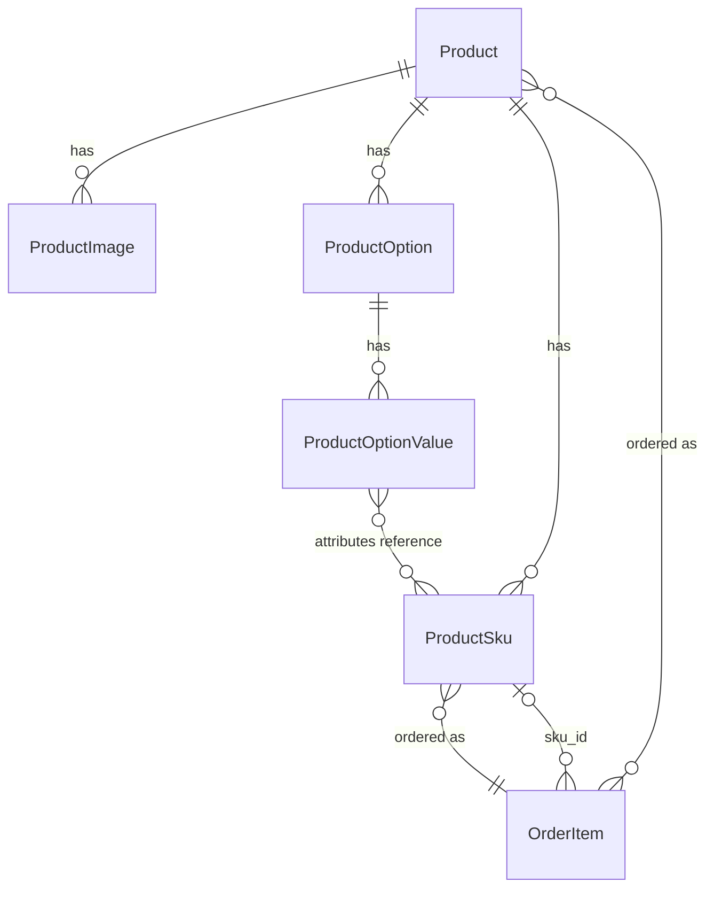
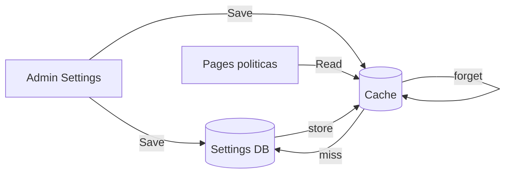
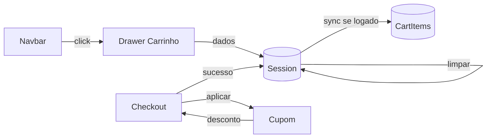

# Marketplace Module Loja Missionária

 Implementar o módulo Marketplace (Loja Missionária) como e-commerce integrado: domínio de produtos/campanhas, frete (retirada + Correios), pagamento via PaymentGateway, sincronização com Treasury, vitrine na HomePage, "Minhas Compras" no MemberPanel, Admin com dashboard e Elias (sugestão de estoque baixo), e notificações via Notifications.


# Plano: Módulo Marketplace (Loja Missionária) - VertexCBAV

## Contexto de integração (descoberto)

- **PaymentGateway**: `PaymentService::createPayment()` com `payment_type`, `payable_type`, `payable_id`; `confirmPayment()` dispara `PaymentReceived`. Eventos usam `payable` = `EventRegistration`; doações usam `Campaign` ou `Ministry`.
- **Treasury**: `HandlePaymentReceived` cria `FinancialEntry` quando `payable_type` é Campaign ou Ministry; ignora `event_registration` (feito por `RegistrationConfirmedListener`). Campanhas vêm de `Modules\Treasury\App\Models\Campaign` (id, name, slug, target_amount, current_amount, etc.).
- **Notifications**: `InAppNotificationService::sendToUser()` / `sendToAdmins()` com `action_url`, `action_text`, `type`; usado em pagamentos, eventos, conselho.
- **HomePage**: `HomePageController::index()` usa `getHomepageSettings()` (ex.: `show_events`, `show_campaigns`); passa variáveis para `homepage::index`; seções condicionais com `@if ($homepageSettings['show_events'] && ...)`.
- **MemberPanel**: Sidebar em [Modules/MemberPanel/resources/views/components/sidebar.blade.php](../../../../../Users/Administrator/.cursor/plans/Modules/MemberPanel/resources/views/components/sidebar.blade.php); rotas em `routes/member.php` com prefixo `painel`; não existe "Minhas Compras" ainda.
- **Admin**: Gráficos com Chart.js (dashboard principal) e ApexCharts (PaymentGateway, Intercessor); padrão de status (badges) em Events registrations.
- **Marketplace atual**: Stub com um controller, rotas web/api, providers; **sem models, sem migrations** ([Modules/Marketplace](../../../../../Users/Administrator/.cursor/plans/Modules/Marketplace)).

---

## 1. Domínio: produtos, campanhas e estoque

**Models e migrations (dentro de `Modules/Marketplace`)**

- **Product**
  - Campos: `id`, `uuid` (unique, para URLs públicas), `title`, `slug`, `description` (text), `price` (decimal), `stock` (int, default 0), `category` (enum: alimentacao, vestuario, livros, eventos_oficinas), `campaign_id` (FK nullable para `treasury.campaigns`), `delivery_type` (enum: local_pickup, shipping, both), `weight_grams` (nullable), `length_cm`, `width_cm`, `height_cm` (nullable, para frete), `is_active`, `sort_order`, `timestamps`, `soft_deletes`.
  - Relações: `belongsTo(Campaign::class)` (Treasury); scopes: `active()`, `inStock()`.
  - Constantes de categoria e delivery_type no model.
- **PickupLocation** (opcional, para retirada)
  - Campos: `id`, `name`, `address`, `instructions` (text), `availability` (JSON: horários/dias), `is_active`, `timestamps`.
  - Relação: Product pode ter `pickup_location_id` ou usar um pickup global por campanha; para MVP pode ser um único registro "Cantina após o culto" configurável no Admin.
- **Order**
  - Campos: `id`, `uuid` (unique, usado em links e rastreio), `user_id` (nullable para guest), `email`, `payer_name`, `status` (enum: pending, paid, preparing, shipped_ready_for_pickup, completed, cancelled), `delivery_type` (local_pickup | shipping), `shipping_address` (JSON: CEP, rua, número, etc.), `pickup_location_id` (nullable), `tracking_code` (nullable, Correios), `total_amount`, `shipping_amount`, `campaign_id` (do primeiro produto ou principal, para Treasury), `paid_at`, `shipped_at`, `completed_at`, `metadata` (JSON), `timestamps`.
  - Relações: `belongsTo(User::class)`, `belongsTo(Campaign::class)`, `hasMany(OrderItem::class)`, `hasOne(Payment)` via morph (Payment->payable_type = Order).
- **OrderItem**
  - Campos: `order_id`, `product_id`, `title`, `price`, `quantity`, `options` (JSON), `timestamps`.
  - Relações: `belongsTo(Order::class)`, `belongsTo(Product::class)`.

Regras de negócio: (1) Produto obrigatoriamente vinculado a uma campanha (Treasury). (2) Ao criar pedido, reservar estoque (decrementar `product.stock` ou usar tabela de reserva com TTL; no checkout validar estoque em tempo real). (3) UUID em Order e Product para URLs e impressão de etiquetas.

---

## 2. Logística e frete (Correios)

- **Correios API**
  - Criar `Modules\Marketplace\App\Services\CorreiosShippingService` (ou `FreightService` que abstrai):
    - Método `calculate(string $cepOrigin, string $cepDest, float $weightKg, array $dimensionsCm): array` retornando opções Sedex/PAC com preço e prazo.
    - Usar API oficial dos Correios (ex.: [Calculador de preços e prazos](https://www.correios.com.br/atendimento/ferramentas/sistemas/calculador-remessa-de-encomendas)); exigirá contrato/credenciais em produção.
    - **Cache**: cachear por chave `freight:{cepOrigin}:{cepDest}:{weight}:{dims}` (ex.: 1h TTL) para evitar lentidão e excesso de chamadas.
  - Configuração: CEP de origem e credenciais (se necessário) em Settings ou `config/marketplace.php`; Admin pode definir CEP padrão da igreja.
- **Rastreio**
  - Campo `Order.tracking_code` preenchido pelo lojista no Admin ao marcar "Enviado".
  - Endpoint ou link para rastreio (ex.: URL dos Correios com o código); exibir no MemberPanel e no email/notificação.
- **Status do pedido**
  - Fluxo: `pending` (criado) → `paid` (pagamento confirmado) → `preparing` (lojista preparando) → `shipped_ready_for_pickup` (enviado ou pronto para retirada) → `completed`.
  - Constantes no model `Order` (ex.: `Order::STATUS_PENDING`, ...).

---

## 3. Pagamento e Treasury

- **PaymentGateway**
  - Criar pagamento com `payment_type = 'marketplace_order'`, `payable_type = Order::class`, `payable_id = $order->id`, `amount = $order->total_amount` (já incluindo frete se houver).
  - Fluxo: checkout (single page) → criar Order + OrderItems (status pending) → `PaymentService::createPayment()` → Brick ou PIX; na confirmação (webhook/return) → `confirmPayment()` → dispara `PaymentReceived`.
- **Treasury (evitar duplicação e garantir campanha)**
  - Em [Modules/Treasury/app/Listeners/HandlePaymentReceived.php](../../../../../Users/Administrator/.cursor/plans/Modules/Treasury/app/Listeners/HandlePaymentReceived.php): no início, se `payment_type === 'marketplace_order'`, **return** (não criar entrada aqui).
  - No módulo Marketplace: registrar listener `PaymentReceived` → **CreateMarketplaceTreasuryEntryListener**:
    - Se `payment->payment_type !== 'marketplace_order'` ou já existe `payment->financialEntry`, return.
    - Carregar `Order` por `payable_id`; obter `campaign_id` do pedido (ou do primeiro produto).
    - Criar `FinancialEntry` com `campaign_id`, `payment_id`, `type = 'income'`, `category = 'Loja'` (ou categoria existente "Campanha" se preferir relatório unificado), `reference_number = 'ORDER-' . $order->uuid`, `metadata` com order_id; idempotência por `reference_number` ou `payment_id`.
  - Garantir que `Campaign::updateCurrentAmount()` seja chamado (já feito pelo PaymentObserver quando existe `campaign_id` na entrada; verificar se Treasury atualiza current_amount ao criar entrada manualmente).

---

## 4. Frontend: vitrine, MemberPanel e checkout

- **Vitrine na HomePage**
  - Em [Modules/HomePage/App/Http/Controllers/HomePageController.php](../../../../../Users/Administrator/.cursor/plans/Modules/HomePage/App/Http/Controllers/HomePageController.php): adicionar variável `$featuredProducts` (ex.: `Product::active()->inStock()->whereHas('campaign')->orderBy('sort_order')->limit(6)`); adicionar em `getHomepageSettings()` uma chave `show_marketplace` (Settings).
  - Em [Modules/HomePage/resources/views/index.blade.php](../../../../../Users/Administrator/.cursor/plans/Modules/HomePage/resources/views/index.blade.php): nova seção condicional `@if ($homepageSettings['show_marketplace'] ?? false && $featuredProducts->count() > 0)` com grid de cards (título "Loja Missionária", link para rota da loja).
  - Rotas públicas no Marketplace: `GET /loja` (listagem), `GET /loja/produto/{uuid}` (detalhe), `GET /loja/checkout` (carrinho/checkout single page). Layout usar master da HomePage ou do Marketplace com mesmo padrão visual.
- **MemberPanel: Minhas Compras**
  - Em [Modules/MemberPanel/resources/views/components/sidebar.blade.php](../../../../../Users/Administrator/.cursor/plans/Modules/MemberPanel/resources/views/components/sidebar.blade.php): nova entrada "Minhas Compras" (ou "Loja" com submenu) apontando para `memberpanel.marketplace.orders.index` (ou `marketplace.member.orders.index`).
  - Rotas em `routes/member.php`: prefixo `painel`, grupo Marketplace (ex.: `painel/loja/pedidos` → listagem de pedidos do usuário; `painel/loja/pedidos/{uuid}` → detalhe com status, tracking, QR para retirada).
  - Views no módulo Marketplace: `resources/views/memberpanel/orders/index.blade.php`, `show.blade.php`; usar `<x-icon>`, `<x-loading-overlay />`, Tailwind 4.1, badges de status (inspirado em Events).
- **Checkout (single page)**
  - Uma única view (ex.: `Marketplace/resources/views/public/checkout.blade.php`) com: resumo do carrinho, seleção de entrega (retirada vs envio), se envio: CEP + cálculo de frete (Alpine ou fetch para endpoint `POST /api/v1/marketplace/freight` com cache); formulário de dados do comprador; botão pagar que dispara `loading-overlay:show` e submete para criar Order + Payment; redirecionamento para página de pagamento (Brick/PIX) ou confirmação.
  - Validação de estoque em tempo real: antes de criar o pedido, revalidar quantidades (Product::inStock()); se indisponível, retornar erro e não criar pagamento.
  - Uso de `<x-loading-overlay />` no layout e `window.dispatchEvent(new CustomEvent('loading-overlay:show', { detail: { message: 'Processando pagamento...' } }))` no submit.

---

## 5. Admin: dashboard, pedidos e etiquetas

- **Dashboard de vendas**
  - Controller Admin Marketplace (ex.: `Modules\Marketplace\App\Http\Controllers\Admin\DashboardController`): dados agregados por campanha (total vendido, quantidade de pedidos), período (mês/ano).
  - Gráfico: Chart.js ou ApexCharts (alinhado ao restante do Admin) com arrecadação por campanha; view em `Marketplace/resources/views/admin/dashboard.blade.php`.
  - Rotas Admin: prefixo `admin` (ex.: `admin/marketplace`, `admin/marketplace/orders`); registrar no sidebar Admin.
- **Gestão de pedidos**
  - CRUD de pedidos em modo leitura/atualização: listagem com filtros (status, campanha, data); tela de detalhe do pedido com botões "Marcar como Preparando", "Marcar como Enviado" (com campo tracking_code), "Pronto para Retirada", "Finalizar".
  - Produtos: CRUD completo (create/edit Product com categoria, campanha, estoque, dimensões, tipo de entrega); listagem com indicador de estoque baixo.
- **Impressão de etiquetas**
  - Rota `GET admin/marketplace/orders/{order}/label` (ou `print-label`) que retorna view/PDF com resumo do pedido (uuid, itens, endereço se envio, nome do comprador) para colar na embalagem; usar mesma stack de PDF do projeto (ex.: mpdf ou Browsershot) se já existir.

---

## 6. Notificações

- Usar `InAppNotificationService` (injetar ou `app()->make()`):
  - **Pedido aprovado (pago)**: ao confirmar pagamento (listener no Marketplace após PaymentReceived ou no mesmo listener que cria Treasury), `sendToUser($order->user, 'Pedido aprovado!', 'Seu pedido #' . $order->uuid . ' foi confirmado.', ['type' => 'success', 'action_url' => route('memberpanel.marketplace.orders.show', $order->uuid), 'action_text' => 'Ver pedido'])`.
  - **Pronto para retirada**: quando Admin marca "Pronto para retirada", `sendToUser(..., 'Seu pedido está pronto para retirada!', '... na cantina após o culto.', action_url para Minhas Compras)`.
  - **Enviado (rastreio)**: quando Admin preenche tracking e marca "Enviado", `sendToUser(..., 'Seu pedido foi enviado!', 'Rastreio: ' . $trackingCode, action_url com link para rastreio)`.
- Notificações disparadas a partir de Observers do Order (status change) ou de ações do controller Admin.

---

## 7. Elias (sugestão de estoque baixo no Admin)

- **Definição**: "Elias" como persona de sugestões no Admin (ex.: card ou bloco no dashboard Marketplace ou dashboard geral).
- **Lógica**: Job ou método chamado no carregamento do dashboard Admin Marketplace: produtos com `stock > 0` e `stock <= threshold` (ex.: 5 ou configurável); listar e exibir mensagem: "Pastor, a camisa 'Missões 2026' está com estoque baixo. Deseja notificar a igreja?".
- **Ação opcional**: botão "Notificar igreja" que dispara uma notificação em massa (ex.: `sendToRole('member', ...)` ou lista de usuários) com link para a loja; ou criar uma SystemNotification global "Produto X em estoque baixo - aproveite".
- Implementação: método em um service (ex.: `MarketplaceEliasService::getLowStockSuggestions()`) e um partial Blade no dashboard Admin que renderiza o bloco quando há sugestões.

---

## 8. Instruções técnicas adicionais

- **UUIDs**: Todos os pedidos e produtos com `uuid` (string, unique); usar em rotas e impressões (`Order::uuid`, `Product::uuid`).
- **Design**: Tailwind 4.1, componente `<x-icon name="..." style="duotone" />` ([resources/views/components/icon.blade.php](../../../../../Users/Administrator/.cursor/plans/resources/views/components/icon.blade.php)), `<x-loading-overlay />` ([resources/views/components/loading-overlay.blade.php](../../../../../Users/Administrator/.cursor/plans/resources/views/components/loading-overlay.blade.php)); seguir padrão premium (glassmorphic, didático) conforme [system_default.md](../../../../../Users/Administrator/.cursor/plans/system_default.md).
- **Cache**: Cálculos de frete com Cache::remember (chave por CEP origem/destino + peso + dimensões; TTL sugerido 1h).
- **i18n**: Se o projeto usar lang para Marketplace, criar `Modules/Marketplace/lang/pt_BR/messages.php` para labels (ex.: status do pedido, categorias).

---

## Ordem sugerida de implementação

1. Migrations e models (Product, Order, OrderItem, PickupLocation); seeders mínimos (uma campanha, um produto).
2. Treasury: ajuste em HandlePaymentReceived (return para marketplace_order) + CreateMarketplaceTreasuryEntryListener no Marketplace.
3. PaymentGateway: fluxo de criação de Order + Payment (payment_type marketplace_order, payable Order); listener de PaymentReceived para atualizar Order status → paid e criar Treasury entry.
4. Correios/Freight service com cache; endpoint de cálculo de frete para o checkout.
5. Rotas e controllers públicos (vitrine, listagem loja, detalhe produto, checkout single page); integração HomePage (show_marketplace + featuredProducts).
6. MemberPanel: rotas e views Minhas Compras (listagem e detalhe com tracking/QR).
7. Admin: CRUD produtos, gestão de pedidos (status, tracking), dashboard com gráfico por campanha, impressão de etiqueta.
8. Notificações (pedido aprovado, pronto retirada, enviado com rastreio).
9. Elias: low-stock suggestions no dashboard Admin Marketplace e ação "Notificar igreja".

---

## Diagrama de fluxo (resumo)

```mermaid
flowchart LR
    subgraph storefront [Loja Pública]
        HP[HomePage vitrine]
        Loja[Listagem/Detalhe]
        Checkout[Checkout Single Page]
        HP --> Loja --> Checkout
    end
    subgraph payment [Pagamento]
        Checkout --> CreateOrder[Order + Payment]
        CreateOrder --> Gateway[PaymentGateway]
        Gateway --> Confirm[confirmPayment]
        Confirm --> PaymentReceived[PaymentReceived]
    end
    subgraph after [Pós-pagamento]
        PaymentReceived --> UpdateOrder[Order status = paid]
        PaymentReceived --> TreasuryListener[CreateMarketplaceTreasuryEntry]
        PaymentReceived --> NotifyUser[Notificação "Pedido aprovado"]
        TreasuryListener --> FinancialEntry[FinancialEntry + Campaign]
    end
    subgraph admin [Admin]
        Dashboard[Dashboard vendas]
        Orders[Gestão pedidos]
        Orders --> Shipped[Enviado / Retirada]
        Shipped --> NotifyShipped[Notificação rastreio/retirada]
        Elias[Elias estoque baixo]
    end
```

----------- ETAPA 2: Implementação --------------------

# Marketplace Pro Variações Galeria
Implementar no Marketplace: galeria de imagens (product_images), variações/SKUs (product_options, product_option_values, product_skus), atributos dinâmicos (sample_url, specifications), storefront com galeria/zoom e seletor de variações, admin com upload múltiplo e gerador de grade, e checkout/carrinho por SKU com validação de estoque.


# Plano: Marketplace Pro – Variações e Galeria

## Contexto atual

- **Product**: [Modules/Marketplace/app/Models/Product.php](../../../../../Users/Administrator/.cursor/plans/Modules/Marketplace/app/Models/Product.php) – `price`, `stock`, `image_url`, `description`; sem galeria nem variações.
- **OrderItem**: [Modules/Marketplace/app/Models/OrderItem.php](../../../../../Users/Administrator/.cursor/plans/Modules/Marketplace/app/Models/OrderItem.php) – `product_id`, `title`, `price`, `quantity`, `options` (JSON). Já permite armazenar dados extras em `options`.
- **Checkout**: [MarketplaceCheckoutService](../../../../../Users/Administrator/.cursor/plans/Modules/Marketplace/app/Services/MarketplaceCheckoutService.php) valida estoque em `product.stock` e decrementa no produto; itens do carrinho são `product_id` + `quantity` (sem `sku_id`).
- **Storefront**: Blade + Alpine.js (sem Vue). Detalhe do produto em [marketplace::public.show](../../../../../Users/Administrator/.cursor/plans/Modules/Marketplace/resources/views/public/show.blade.php) com uma imagem e botão “Adicionar ao carrinho” (só `product_id`).
- **Admin produto**: [ProductController](../../../../../Users/Administrator/.cursor/plans/Modules/Marketplace/app/Http/Controllers/Admin/ProductController.php) e views create/edit com um único campo `image_url`.

Decisão de stack: manter **Blade + Alpine.js** no storefront (conforme AGENTS.md e loja atual). Galeria, seletor de variações e tabs podem ser feitos com Alpine; não é necessário introduzir Vue 3 no módulo.

---

## 1. Estrutura de dados (backend)

### 1.1 Tabela `marketplace_product_images`

- **Migration**: `product_id` (FK), `path` (string – caminho em `storage`, ex: `marketplace/products/123/abc.jpg`), `sort_order` (unsignedInteger, default 0), `caption` (string nullable), `timestamps`.
- **Model**: `ProductImage` – `belongsTo(Product::class)`. Scopes/accessors conforme necessário.
- **Product**: `hasMany(ProductImage::class)->orderBy('sort_order')`. Manter `image_url` como fallback (primeira imagem da galeria ou URL antiga).

### 1.2 Opções e valores (dimensões de variação)

- `**marketplace_product_options`: `id`, `product_id` (FK), `name` (ex: "Tamanho", "Cor"), `sort_order` (default 0), `timestamps`.
- `**marketplace_product_option_values`: `id`, `product_option_id` (FK), `value` (ex: "P", "Azul"), `sort_order` (default 0), `timestamps`.
- **Models**: `ProductOption` (belongsTo Product, hasMany ProductOptionValue), `ProductOptionValue` (belongsTo ProductOption).

### 1.3 Tabela `marketplace_product_skus`

- **Campos**: `id`, `product_id` (FK), `sku_code` (string, unique, ex: "CAMISA-M-AZUL"), `attributes` (JSON, ex: `{"Tamanho":"M","Cor":"Azul"}`), `price_override` (decimal nullable – se null, usa preço do produto), `stock` (unsignedInteger, default 0), `barcode` (string nullable), `weight_grams` (unsignedNullable), `length_cm`, `width_cm`, `height_cm` (nullable, para frete), `timestamps`.
- **Model**: `ProductSku` – `belongsTo(Product::class)`. Método helper para “display name” da variação (ex: "Tamanho M, Cor Azul") a partir de `attributes`.
- **Product**: `hasMany(ProductSku::class)`. Helper `hasVariations(): bool` (ex.: `$product->skus()->exists()`). Preço/estoque no storefront: se tem SKUs, preço mínimo dos SKUs em estoque (ou “a partir de”) e estoque total = soma dos skus; sem SKUs, usa `product.price` e `product.stock`.

### 1.4 Atributos dinâmicos no Product

- **Migration** (alterar `marketplace_products`): `sample_url` (string nullable) – link para amostra (livros); `specifications` (JSON nullable) – ingredientes ou especificações técnicas.
- **Model Product**: adicionar aos `$fillable` e `$casts` (`specifications` => `'array'`).

### 1.5 OrderItem e carrinho

- **Migration** (alterar `marketplace_order_items`): `sku_id` (foreignId nullable, FK para `marketplace_product_skus`).
- **OrderItem**: `fillable` + `sku_id`; `belongsTo(ProductSku::class, 'sku_id')`. Ao exibir: título = produto + variação (ex: "Camisa Missões - Tamanho G"); se `sku_id` preenchido, usar `sku->display_name` ou montar a partir de `options`/attributes.
- **Carrinho (sessão)**: estrutura atual `['product_id' => x, 'quantity' => n]` passa a aceitar opcionalmente `'sku_id' => y`. Se `sku_id` presente, preço e estoque vêm do SKU; senão, do produto (comportamento atual para produtos sem variação).
- **Checkout e OrderItem**: ao criar OrderItem, gravar `sku_id` quando aplicável; `title` deve incluir descrição da variação (ex: "Camisa Missões - Tamanho G"); `options` pode guardar `attributes` do SKU para exibição no admin/membro.

---

## 2. Lógica de estoque e preço

- **Produto sem SKUs**: continua usando `product.stock` e `product.price`; decrementar em `product` ao confirmar pedido.
- **Produto com SKUs**: estoque e preço por SKU; ao adicionar ao carrinho e no checkout, enviar `sku_id`; validar e decrementar `sku.stock` no CheckoutService. Não decrementar `product.stock` quando o item for por SKU.
- **Storefront “em estoque”**: produto sem variações → `stock > 0`; com variações → pelo menos um SKU com `stock > 0`. Listagem (index) e detalhe devem considerar isso (eager load `skus` onde necessário).

---

## 3. Frontend – Storefront (Blade + Alpine.js)

### 3.1 Galeria no detalhe do produto

- **Controller**: [StorefrontController::show](../../../../../Users/Administrator/.cursor/plans/Modules/Marketplace/app/Http/Controllers/Public/StorefrontController.php) – carregar `$product->load(['images' => fn($q) => $q->orderBy('sort_order'), 'skus', 'options.values'])` (e campaign, pickupLocation).
- **View** [marketplace::public.show](../../../../../Users/Administrator/.cursor/plans/Modules/Marketplace/resources/views/public/show.blade.php):
  - **Galeria**: container com imagem principal (primeira de `images` ou `image_url`) e lista de miniaturas (ordem por `sort_order`). Alpine: estado `currentImageIndex`; clique na miniatura troca a principal; transição suave (Tailwind `transition-opacity` ou classe Animate). Opcional: zoom na principal (Alpine + CSS scale ou modal com imagem grande).
  - Se não houver imagens nem `image_url`, manter placeholder com ícone (ex.: `fa-images`).

### 3.2 Seletor de variações (swatches)

- Se `$product->skus->isNotEmpty()`: renderizar uma seção “Opções” por `product.options` (ex.: “Tamanho” com botões P, M, G). Cada opção lista `option->values`. Alpine: estado `selectedAttributes` (ex: `{ Tamanho: 'M', Cor: 'Azul' }`). Ao mudar seleção, encontrar o SKU cujo `attributes` corresponda a `selectedAttributes`; atualizar no DOM o preço (e “em estoque” / “esgotado”) e guardar `sku_id` para o formulário de “Adicionar ao carrinho”.
  - Endpoint leve opcional: `GET /api/v1/marketplace/products/{id}/sku-by-attributes` com query `attributes[Tamanho]=M&attributes[Cor]=Azul` retornando `{ sku_id, price, stock }` para evitar expor todos os SKUs no HTML. Alternativa: enviar no Blade a lista de SKUs (ou um JSON) e resolver no Alpine.
- Botão “Adicionar ao carrinho”: se há variações, exigir que todas as opções estejam selecionadas e que o SKU esteja em estoque; submit com `product_id` + `sku_id` (e quantity). Link/redirect para checkout continua `?add=...`; para variação, usar algo como `?add=product_id&sku_id=sku_id` ou POST para uma rota que adiciona ao carrinho e redireciona.

### 3.3 Tabs de informação

- Abaixo da galeria e do seletor (e do botão de carrinho), blocos em abas (Alpine `x-data` com `activeTab`):
  - **Descrição geral**: conteúdo de `product.description` (já existe).
  - **Detalhes técnicos / Ingredientes**: conteúdo de `product.specifications` (JSON renderizado em lista ou texto conforme o tipo; ex.: ingredientes para alimentação, specs para eletrônicos).
  - **Amostra digital**: exibida apenas se `product.category === livros` e `product.sample_url` preenchido – link ou iframe para amostra (PDF/externo). Ícone sugerido: `fa-book-open-reader`.

### 3.4 Ícones e UX

- Usar Font Awesome Duotone: `fa-images` (galeria), `fa-layer-group` (variações), `fa-utensils` (ingredientes se categoria alimentação), `fa-book-open-reader` (amostra). Manter CTA “Apoiar Missões” visível (já existe na home; no detalhe pode haver link de volta para a loja).

---

## 4. Admin – Gestão de produtos

### 4.1 Upload múltiplo de imagens

- **Migration** já criada para `marketplace_product_images`; armazenar em `storage/app/public/marketplace/products/{product_id}/` (ou similar) e registrar path na tabela.
- **ProductController (create/edit)**: aceitar `images[]` (array de arquivos) e/ou manter campo único `image_url` para compatibilidade. Após criar/atualizar produto, processar uploads: salvar arquivos, criar registros em `ProductImage` com `sort_order` sequencial.
- **Reorder**: endpoint `POST/PUT admin/marketplace/products/{product}/images/reorder` com array `[id => order]` para atualizar `sort_order`. Chamado por Alpine ou JS ao arrastar.
- **View admin (create/edit)**: componente de upload (Blade + Alpine) – área de drop para múltiplos arquivos; preview das imagens; opção de remover e reordenar (lista com drag-handle). Envio via formulário com `images[]` ou via AJAX (upload imediato) e persistência no backend.

### 4.2 Opções e gerador de grade (SKUs)

- **Opções**: na tela de edição do produto, seção “Variações”:
  - Listar opções atuais (ex.: Tamanho, Cor). Para cada opção, listar valores (P, M, G). Formulário para adicionar opção (nome) e valores (lista de strings).
  - Rotas/controller: `POST admin/marketplace/products/{product}/options` (criar opção com valores), `DELETE .../options/{option}`. Ou gerenciar tudo no mesmo form do produto (array `options[name][]` e `options[values][name][]`).
- **Gerador de grade**: botão “Gerar grade de SKUs”. Modal ou seção: admin seleciona quais opções usar (ex.: só Tamanho) e quais valores (P, M, G). Backend gera o produto Cartesiano (ex.: 3 SKUs com `attributes` {"Tamanho":"P"}, {"Tamanho":"M"}, {"Tamanho":"G"}) e cria registros em `product_skus` com `sku_code` único (ex.: `slug-TAMANHO-P`), `stock` 0, `price_override` null. Depois o admin preenche estoque (e opcionalmente preço) por SKU na listagem/edição de SKUs.
- **CRUD de SKUs**: listagem por produto (ex.: `admin/marketplace/products/{product}/skus`), criar/editar SKU (código, atributos, preço override, estoque, código de barras). Ou edição inline na tela do produto.

### 4.3 Amostra (livros)

- No form do produto: campo “Amostra (URL ou arquivo)” – `sample_url` (texto) ou upload de PDF armazenado e URL gerada. Exibir apenas quando categoria = livros. Preview: link “Ver amostra” que abre em nova aba.

---

## 5. Checkout e carrinho

### 5.1 Carrinho (sessão)

- Estrutura do item: `['product_id' => int, 'quantity' => int, 'sku_id' => int|null]`. Se `sku_id` presente, o preço e a validação de estoque usam o SKU.
- **CheckoutController::show**: ao montar o carrinho para a view, para cada item com `sku_id` carregar o SKU (eager load) e usar `sku->price_override ?? product->price` e `sku->stock`; passar produtos e SKUs para a view para exibir “Camisa Missões - Tamanho G” e preço correto.
- **Adicionar ao carrinho** (storefront): link ou form para `marketplace.storefront.checkout` com `add=product_id` e opcionalmente `sku_id=id`. CheckoutController ao processar `add`, se vier `sku_id`, valida estoque do SKU e adiciona ao carrinho com `sku_id`.

### 5.2 MarketplaceCheckoutService

- Para cada item: se `sku_id` presente, buscar `ProductSku`; validar `sku->stock >= quantity`; usar `sku->price_override ?? product->price`; ao criar OrderItem, preencher `sku_id`, `title` = produto + descrição da variação (ex.: "Camisa Missões - Tamanho G"), `options` com `attributes` do SKU; decrementar `sku->stock`. Se não houver `sku_id`, comportamento atual (product.stock, product.price, decrementar product).
- Validação “variação ainda em estoque” antes de criar o pedido: garantir que nenhum item (por produto ou por SKU) exceda o estoque disponível.

### 5.3 Resumo do pedido (Admin e MemberPanel)

- **OrderItem**: já possui `title` e `options`. Garantir que ao criar o item com variação, `title` seja algo como “Produto X - Tamanho G, Cor Azul” e `options` tenha os attributes. Views de listagem/detalhe do pedido (admin e member) devem exibir esse `title` (e opcionalmente `options`) para mostrar a variação comprada. Nenhuma mudança estrutural além de popular corretamente ao criar o item.

---

## 6. API e eager loading

- **StorefrontController (index)**: para listagem, `Product::active()->with(['campaign', 'images' => fn($q) => $q->orderBy('sort_order')->limit(1)])` (ou só primeira imagem) para exibir thumbnail. Produtos com variações: usar preço mínimo dos SKUs em estoque (ou preço base) e “em estoque” se soma(sku.stock) > 0.
- **StorefrontController (show)**: `$product->load(['images' => fn($q) => $q->orderBy('sort_order')], 'campaign', 'pickupLocation', 'options.values', 'skus')`.
- **CheckoutController (show)**: ao buscar produtos do carrinho, `Product::with(['skus'])->whereIn('id', $productIds)->get()` para itens com `sku_id`; resolver preço e título por SKU na view.
- Endpoint opcional para seletor em tempo real: `GET /api/v1/marketplace/products/{id}/sku-by-attributes?attributes[Tamanho]=M` retornando `{ sku_id, price, stock, display_name }` (evita enviar todos os SKUs no HTML).

---

## 7. Ordem sugerida de implementação

1. **Migrations**: `product_images`, `product_options`, `product_option_values`, `product_skus`; alterações em `marketplace_products` (`sample_url`, `specifications`) e `marketplace_order_items` (`sku_id`).
2. **Models e relações**: ProductImage, ProductOption, ProductOptionValue, ProductSku; relações em Product; OrderItem.sku_id e relação ProductSku.
3. **CheckoutService e carrinho**: aceitar `sku_id` nos items; validar estoque por SKU; criar OrderItem com sku_id e title/options; decrementar sku.stock ou product.stock.
4. **Storefront show**: galeria (imagens + miniaturas + transição); seletor de variações (Alpine + SKUs); tabs Descrição / Detalhes / Amostra; botão adicionar ao carrinho com product_id + sku_id.
5. **Admin**: upload múltiplo de imagens (create/edit) e reorder; CRUD de opções/valores e gerador de grade de SKUs; CRUD ou listagem/edição de SKUs por produto; campos sample_url e specifications e preview amostra.
6. **Checkout view e resumo**: exibir título da variação no carrinho e no resumo do pedido (admin e member); garantir que o formulário de checkout envie `items[].sku_id` quando aplicável.
7. **Index storefront**: usar primeira imagem da galeria (ou image_url) no card; para produtos com variações, preço “a partir de” e estoque total; links para show com slug.

---

## Diagrama de relações (resumo)



- **Product**: `sample_url`, `specifications` (JSON); relações `images`, `options`, `skus`.
- **ProductSku**: `attributes` JSON mapeia option name → value; preço/estoque por SKU.
- **OrderItem**: `sku_id` opcional; `title` e `options` descrevem a variação comprada.
- **Carrinho**: itens com `product_id` + `sku_id` (opcional); checkout valida e decrementa estoque do produto ou do SKU.

----------- ETAPA 3: Implementação --------------------

# Marketplace Elite Finalization
 Implementar a camada de confiança (políticas CMS, páginas legais, rodapé com selos), design de vitrine (badges, filtros, carrinho sticky), timeline de pedido no MemberPanel, manutenção/Elias no Admin e ajustes de UI/UX, sem alterar o plano anexado.

# Marketplace Elite – Políticas, Design e Rastreio

## Contexto técnico

- **Loja:** Rotas em [Modules/Marketplace/Routes/web.php](../../../../../Users/Administrator/.cursor/plans/Modules/Marketplace/Routes/web.php) (prefixo `loja`). Storefront usa layout [homepage::components.layouts.master](../../../../../Users/Administrator/.cursor/plans/Modules/HomePage/resources/views/components/layouts/master.blade.php) (navbar + footer global).
- **Order:** [Order](../../../../../Users/Administrator/.cursor/plans/Modules/Marketplace/app/Models/Order.php) já tem `tracking_code`, `tracking_url` (Correios), `paid_at`, `shipped_at`, `completed_at` e status `pending` → `paid` → `preparing` → `shipped_ready_for_pickup` → `completed`. [OrderController](../../../../../Users/Administrator/.cursor/plans/Modules/Marketplace/app/Http/Controllers/Admin/OrderController.php) atualiza status e notifica ao marcar "Enviado" com código.
- **Settings:** [App\Models\Settings](../../../../../Users/Administrator/.cursor/plans/app/Models/Settings.php) (get/set com cache 24h). Chave atual da loja: `homepage_show_marketplace`.
- **Rich text:** Projeto usa `<x-rich-editor>` (Quill) em [resources/views/components/rich-editor.blade.php](../../../../../Users/Administrator/.cursor/plans/resources/views/components/rich-editor.blade.php).
- **Elias:** [MarketplaceEliasService](../../../../../Users/Administrator/.cursor/plans/Modules/Marketplace/app/Services/MarketplaceEliasService.php) hoje só sugere estoque baixo; [EliasController](../../../../../Users/Administrator/.cursor/plans/Modules/Marketplace/app/Http/Controllers/Admin/EliasController.php) envia notificação para membros. Dashboard em [marketplace::admin.dashboard](../../../../../Users/Administrator/.cursor/plans/Modules/Marketplace/resources/views/admin/dashboard.blade.php).
- **Página fechada:** [marketplace::public.closed](../../../../../Users/Administrator/.cursor/plans/Modules/Marketplace/resources/views/public/closed.blade.php) já é exibida com 503 quando a loja está desativada.

---

## 1. Central de Políticas e Conteúdo (CMS)

### 1.1 Admin – Campos de política (aba "Loja Missionária")

- **Onde:** Adicionar aba **"Loja Missionária"** na tela de configuração da HomePage ([Modules/HomePage/resources/views/admin/homepage/settings.blade.php](../../../../../Users/Administrator/.cursor/plans/Modules/HomePage/resources/views/admin/homepage/settings.blade.php)): novo botão na sidebar (ex.: `showTab('loja')`) e bloco `tab-content-loja`.
- **Campos (Rich Text):**
  - Política de Entrega e Prazos
  - Política de Trocas e Devoluções
  - Termos de Uso e Privacidade da Loja
- **Implementação:** Usar o mesmo padrão de abas e do formulário existente; para cada campo usar `<x-rich-editor name="..." :value="...">` (ou equivalente que injete Quill). Enviar no form com os demais campos.
- **Backend:** Em [Admin\App\Http\Controllers\HomePageSettingsController](../../../../../Users/Administrator/.cursor/plans/Modules/Admin/app/Http/Controllers/HomePageSettingsController.php):
  - Incluir na validação: `marketplace_policy_delivery`, `marketplace_policy_returns`, `marketplace_policy_terms` (nullable|string).
  - Incluir no `$settingsMap` o mapeamento para as chaves em Settings (ex.: `marketplace_policy_delivery` → key `marketplace_policy_delivery`, type `string` ou armazenar HTML em text).
  - Em `getHomepageSettings()` (ou onde as configs são montadas para a view), buscar essas três chaves e passar para a blade.
- **Cache:** Ao exibir as políticas no **front** (páginas públicas), ler via helper/serviço que usa `Cache::remember('marketplace_policies', 86400, fn() => [...])` e invalidar esse cache quando as configurações da HomePage (ou da loja) forem salvas (ex.: em `HomePageSettingsController::update` chamar `Cache::forget('marketplace_policies')`).

### 1.2 Rotas e views públicas das políticas

- **Rotas:** Em [Modules/Marketplace/Routes/web.php](../../../../../Users/Administrator/.cursor/plans/Modules/Marketplace/Routes/web.php), dentro do grupo `prefix('loja')`, adicionar:
  - `GET /loja/politica-entrega` → método que exibe política de entrega
  - `GET /loja/trocas` → método que exibe política de trocas e devoluções
  - `GET /loja/termos` → método que exibe termos e privacidade
- **Controller:** Criar `StorefrontController::policyPage(string $slug)` (ou um `PolicyController`) que recebe o tipo (entrega, trocas, termos), lê o HTML do Settings (via camada cacheada), e retorna uma view única reutilizável com título + conteúdo HTML. Rotas passam o slug/tipo correspondente.
- **Views:** Uma view `marketplace::public.policy` (título + `{!! $content !!}`), usando o **layout da loja** (com rodapé da loja) para manter navegação e footer consistentes.

### 1.3 Rodapé da loja e links para políticas

- **Layout da loja:** Criar layout específico para as páginas da loja (ex.: `marketplace::layouts.storefront`) que estende `homepage::components.layouts.master` e sobrescreve ou injeta um **rodapé da loja** (em vez de repetir o footer global só para a loja).
- **Conteúdo do rodapé:**
  - Links para `/loja/politica-entrega`, `/loja/trocas`, `/loja/termos`.
  - Selos de confiança: texto/ícone "Compra Segura" (ex.: `fa-shield-halved`).
  - Formas de pagamento: PIX e Cartão (texto ou ícones).
- **Uso:** Fazer com que as views públicas da loja (index, show, checkout, thank-you e as três páginas de política) usem esse layout com rodapé da loja, para que os links e selos apareçam apenas no contexto da loja.

---

## 2. Design de Vitrine (Storefront)

### 2.1 Badges de produto

- **Dados:**
  - **Novo:** considerar produto "novo" se `created_at >= now()->subDays(30)` (regra em helper ou no model).
  - **Oferta:** adicionar ao model `Product` campo opcional `compare_at_price` (decimal nullable). Se `compare_at_price > price`, exibir badge "Oferta - X%" (X = arredondado de `(1 - price/compare_at_price)*100`).
  - **Esgotado:** produto sem estoque (e sem SKU em estoque).
  - **Apoia a Campanha X:** já existe `campaign_id`; exibir badge com nome da campanha (como hoje, mas posicionado como “selo” se desejado).
- **Migration:** `add_compare_at_price_to_marketplace_products` (nullable decimal).
- **Views:** Na listagem ([marketplace::public.index](../../../../../Users/Administrator/.cursor/plans/Modules/Marketplace/resources/views/public/index.blade.php)) e no detalhe ([marketplace::public.show](../../../../../Users/Administrator/.cursor/plans/Modules/Marketplace/resources/views/public/show.blade.php)), na área da imagem do produto, renderizar badges em overlay (ex.: canto superior esquerdo/direito) com as regras acima, usando classes Tailwind e ícones Font Awesome Duotone conforme o design.

### 2.2 Filtros e busca

- **Busca “instantânea”:** Manter formulário GET em [marketplace::public.index](../../../../../Users/Administrator/.cursor/plans/Modules/Marketplace/resources/views/public/index.blade.php); adicionar Alpine.js no campo de busca: `x-model`, `@input` com debounce (ex.: 300–400 ms) que submete o form ou atualiza a URL (ex.: `window.location = url com query`) para refletir o termo sem precisar clicar em "Filtrar". Alternativa: submeter o form via JS quando o usuário digita (com debounce).
- **Filtro por faixa de preço:** No [StorefrontController](../../../../../Users/Administrator/.cursor/plans/Modules/Marketplace/app/Http/Controllers/Public/StorefrontController.php), aceitar `min_price` e `max_price` (opcionais). Na query, para produtos sem variação usar `product.price`; para produtos com variação usar o preço mínimo dos SKUs (subquery ou join). Aplicar `where` conforme a faixa.
- **Filtro por disponibilidade:** Aceitar parâmetro `availability` (ex.: `in_stock` | `out_of_stock` | todos).
  - `in_stock`: produto com `stock > 0` OU com pelo menos um SKU com `stock > 0`.
  - `out_of_stock`: ativo mas sem estoque (sob encomenda, se a regra de negócio for exibir mesmo assim).
  - Incluir no form da sidebar os controles (select ou radios) e manter submissão GET.

### 2.3 Sticky cart (mobile)

- **Comportamento:** Apenas em viewport mobile (ex.: `md:hidden`), exibir um botão flutuante (canto inferior direito) com ícone de carrinho e contador de itens.
- **Fonte do contador:** Session `marketplace_cart`: soma de `quantity` dos itens. Passar o total do carrinho do backend para a view (ex.: variável `$cartCount` no controller ou via View Composer para rotas da loja) ou ler no front (ex.: data-attribute no layout).
- **Link:** Apontar para `route('marketplace.storefront.checkout')`.
- **Onde:** Incluir o componente no layout da loja (storefront) para que apareça em listagem, detalhe do produto e checkout. Ocultar em viewports maiores (Tailwind).

---

## 3. Sistema de Rastreio e Timeline (MemberPanel)

### 3.1 Timeline visual do pedido

- **View:** [Modules/Marketplace/resources/views/memberpanel/orders/show.blade.php](../../../../../Users/Administrator/.cursor/plans/Modules/Marketplace/resources/views/memberpanel/orders/show.blade.php).
- **Etapas (5):**
  1. Pedido Recebido (sempre concluído)
  2. Pagamento Confirmado (concluído se `status !== pending`)
  3. Em Preparação/Separação (concluído se `status` in [preparing, shipped_ready_for_pickup, completed])
  4. Enviado / Pronto para Retirada (concluído se `status` in [shipped_ready_for_pickup, completed]; se envio por correio, exibir link clicável de rastreio)
  5. Entregue / Finalizado (concluído se `status === completed`)
- **Implementação:** Bloco com lista horizontal ou vertical de etapas; cada etapa com ícone (ex.: check quando concluída, círculo quando pendente) e label. Para a etapa 4, se `order->tracking_code` preenchido, mostrar link `order->tracking_url` (Correios) com texto tipo "Rastrear entrega". Reutilizar o mesmo layout para envio e para retirada local (no caso de retirada, texto "Pronto para retirada" em vez de "Enviado").

### 3.2 Retirada local – mapa/instruções

- **Dados atuais:** [PickupLocation](../../../../../Users/Administrator/.cursor/plans/Modules/Marketplace/app/Models/PickupLocation.php) tem `name`, `address`, `instructions`, `availability`. Não há lat/lng.
- **Curto prazo:** Reforçar na view de detalhe do pedido (quando `delivery_type === 'local_pickup'` e status permite retirada) a exibição de nome, endereço e instruções do `pickupLocation`, junto do QR Code já existente. Opcional: bloco “Onde e quando retirar” com ícone e texto destacado.
- **Opcional (mapa):** Se quiser mapa no futuro, adicionar migration em `marketplace_pickup_locations` com `latitude` e `longitude` (nullable) e, na view, condicionalmente exibir iframe de mapa estático (ex.: OpenStreetMap) ou link “Ver no mapa” para o endereço. Não obrigatório para esta fase.

---

## 4. Gestão de Status e Manutenção (Admin)

### 4.1 Master switch e página de manutenção

- **Master switch:** Já existe: `homepage_show_marketplace` (Settings). Ele é lido em [StorefrontController::storeEnabled()](../../../../../Users/Administrator/.cursor/plans/Modules/Marketplace/app/Http/Controllers/Public/StorefrontController.php) e em [CheckoutController](../../../../../Users/Administrator/.cursor/plans/Modules/Marketplace/app/Http/Controllers/Public/CheckoutController.php). Garantir que todas as rotas públicas da loja (incluindo políticas) verifiquem esse switch e, quando desativado, retornem a página de manutenção (exceto se decidir que políticas ficam acessíveis; normalmente fechar tudo).
- **Página de manutenção:** Atualizar [marketplace::public.closed](../../../../../Users/Administrator/.cursor/plans/Modules/Marketplace/resources/views/public/closed.blade.php) com a mensagem solicitada: “Estamos organizando nosso estoque para a próxima campanha missionária. Voltamos em breve!” e ajustar layout (manter premium, ícone, botão para home).

### 4.2 Elias – Pedidos pendentes de envio

- **Regra:** Pedidos em status `paid` ou `preparing` há mais de 48 horas (critério: `updated_at` ou `created_at` < now()->subHours(48)).
- **Backend:** Em [MarketplaceEliasService](../../../../../Users/Administrator/.cursor/plans/Modules/Marketplace/app/Services/MarketplaceEliasService.php) criar método `getPendingShipmentOrders()` que retorna essa lista (e opcionalmente o total).
- **Dashboard Admin:** Em [marketplace::admin.dashboard](../../../../../Users/Administrator/.cursor/plans/Modules/Marketplace/resources/views/admin/dashboard.blade.php) adicionar card “Elias – Pedidos pendentes de envio”: se houver pedidos, exibir quantidade e link “Gerar etiquetas” (ou “Ver pedidos”) apontando para a listagem de pedidos do Admin (ex.: `route('admin.marketplace.orders.index', ['status' => 'paid'])` ou similar).
- **Notificação ao admin:** Usar [InAppNotificationService::sendToAdmins](../../../../../Users/Administrator/.cursor/plans/Modules/Notifications/App/Services/InAppNotificationService.php) para enviar notificação do tipo: “Temos X pedidos pendentes de envio. Deseja gerar as etiquetas?” com `action_url` para a listagem de pedidos. Disparo: pode ser ao carregar o dashboard do Marketplace (verificar se já não notificou hoje para não spammar) ou via comando agendado (ex.: uma vez ao dia). Definir uma estratégia simples (ex.: só exibir o card no dashboard; notificação opcional por comando).

---

## 5. UI/UX e Finalização

### 5.1 Ícones e loading

- **Ícones Font Awesome Duotone:** Usar nos textos/links de políticas e rodapé da loja: `fa-shield-halved` (Compra Segura), `fa-truck-ramp-box` (entrega), `fa-rotate-left` (devolução). Manter padrão do projeto: `<x-icon name="..." style="duotone" />`.
- **Loading overlay:** Garantir que todas as transições de status do pedido no Admin (form de atualização de status em [admin/orders/show](../../../../../Users/Administrator/.cursor/plans/Modules/Marketplace/resources/views/admin/orders/show.blade.php)) disparem o overlay global. O layout admin provavelmente já inclui `<x-loading-overlay />`; no form, usar `@submit` com `window.dispatchEvent(new CustomEvent('loading-overlay:show', { detail: { message: '...' } }))` conforme [AGENTS.md](../../../../../Users/Administrator/.cursor/plans/AGENTS.md).

### 5.2 Rodapé da loja – selos e pagamentos

- No rodapé da loja (criado no item 1.3): além dos links de políticas, incluir explicitamente selo “Compra Segura” e “Formas de pagamento: PIX, Cartão” (texto ou ícones), alinhado ao restante do design.

### 5.3 Rastreio dinâmico e notificação

- **Admin:** Ao preencher o código de rastreio e marcar status “Enviado / Pronto para retirada”, o [OrderController::updateStatus](../../../../../Users/Administrator/.cursor/plans/Modules/Marketplace/app/Http/Controllers/Admin/OrderController.php) já atualiza `tracking_code` e `shipped_at` e envia notificação ao usuário. Garantir que a mensagem da notificação inclua o link de rastreio (ex.: `action_url` para a página do pedido no MemberPanel, onde o link Correios já é exibido; ou `action_url` direto para `tracking_url`). Nenhuma mudança estrutural grande; apenas revisar texto e link da notificação.

---

## Ordem sugerida de implementação

1. Migration `compare_at_price` e ajustes no model Product; cache das políticas e Settings (chaves + Admin tab + invalidação).
2. Aba “Loja Missionária” no Admin (HomePage settings) com os 3 rich texts; rotas e controller das páginas de política; layout storefront com rodapé (links, selos, pagamentos).
3. Badges na listagem e no detalhe; filtros (preço, disponibilidade) e busca com debounce; sticky cart mobile.
4. Timeline no MemberPanel (orders/show); reforço de instruções/QR para retirada local.
5. Página de manutenção (closed); Elias pedidos pendentes (service + card no dashboard + opcional notificação); loading overlay no form de status do pedido e revisão da notificação de rastreio.

---

## Diagrama – Fluxo de políticas e cache


--------- ETAPA 4: Implementação --------------------

# Kingdom Store v3 Rebuild
Plano de reconstrução ponta a ponta do Marketplace como "Kingdom Store" v3: UI/UX de elite (navbar com carrinho dinâmico, cards estilo ML, sticky footer produto), Media Engine (WebP, vídeo MP4, galeria com zoom), carrinho slide-over + cupons + persistência, Admin (reorder mídia, Modo Vitrine/Manutenção, CRUD cupons), checkout em 1 passo e timeline de rastreio, com Alpine.js e intervention/image.

# Kingdom Store v3 – Reconstrução E-commerce Profissional

## Estado atual (resumo)

- **Carrinho:** Session `marketplace_cart` (array de `product_id`, `quantity`, opcional `sku_id`). Contador no layout storefront via View Composer; botão sticky mobile no footer da loja. Nenhum ícone de carrinho na navbar global (HomePage, Admin, MemberPanel).
- **Loja:** Rotas em [Modules/Marketplace/Routes/web.php](../../../../../Users/Administrator/.cursor/plans/Modules/Marketplace/Routes/web.php) (prefixo `loja`). Storefront estende [marketplace::layouts.storefront](../../../../../Users/Administrator/.cursor/plans/Modules/Marketplace/resources/views/layouts/storefront.blade.php) → [homepage::components.layouts.master](../../../../../Users/Administrator/.cursor/plans/Modules/HomePage/resources/views/components/layouts/master.blade.php). Navbar pública em [HomePage/components/navbar.blade.php](../../../../../Users/Administrator/.cursor/plans/Modules/HomePage/resources/views/components/navbar.blade.php) (sem ícone carrinho).
- **Produto:** [Product](../../../../../Users/Administrator/.cursor/plans/Modules/Marketplace/app/Models/Product.php) com `image_url`, `compare_at_price`; [ProductImage](../../../../../Users/Administrator/.cursor/plans/Modules/Marketplace/app/Models/ProductImage.php) (`path`, `sort_order`). Upload em [ProductController::processImageUploads](../../../../../Users/Administrator/.cursor/plans/Modules/Marketplace/app/Http/Controllers/Admin/ProductController.php) via `$file->store($dir, 'public')` (sem WebP). Já existe `video_url` (string, URL) na migration; não há upload de vídeo nem galeria unificada imagem+video.
- **Checkout:** [CheckoutController](../../../../../Users/Administrator/.cursor/plans/Modules/Marketplace/app/Http/Controllers/Public/CheckoutController.php) – uma tela com itens, entrega (retirada/envio), CEP + frete, dados e pagamento; loading overlay no submit. Não há campo de cupom.
- **Modos da loja:** Apenas `homepage_show_marketplace` (Settings). Quando false, [marketplace::public.closed](../../../../../Users/Administrator/.cursor/plans/Modules/Marketplace/resources/views/public/closed.blade.php) (503). Não existe “Modo Vitrine” (ver sem comprar).
- **Admin:** [ProductController::reorderImages](../../../../../Users/Administrator/.cursor/plans/Modules/Marketplace/app/Http/Controllers/Admin/ProductController.php) (JSON `order[]`); edit product tem imagens mas não há UI drag-and-drop. Dashboard Marketplace em [marketplace::admin.dashboard](../../../../../Users/Administrator/.cursor/plans/Modules/Marketplace/resources/views/admin/dashboard.blade.php).
- **Rastreio:** Timeline de 5 etapas já implementada em [memberpanel/orders/show.blade.php](../../../../../Users/Administrator/.cursor/plans/Modules/Marketplace/resources/views/memberpanel/orders/show.blade.php).
- **Stack:** `intervention/image-laravel` já no [composer.json](../../../../../Users/Administrator/.cursor/plans/composer.json). HomePage carousel usa `Image::read()` e WebP em [Admin HomePageController](../../../../../Users/Administrator/.cursor/plans/Modules/Admin/app/Http/Controllers/HomePageController.php). Ícones: `<x-icon name="..." style="duotone" />`; loading: `<x-loading-overlay />` conforme [system_default.md](../../../../../Users/Administrator/.cursor/plans/system_default.md).

---

## 1. UI/UX "E-commerce de Elite"

### 1.1 Navbar – Ícone de carrinho dinâmico (Admin, Member, Public)

- **Public (HomePage):** Em [Modules/HomePage/resources/views/components/navbar.blade.php](../../../../../Users/Administrator/.cursor/plans/Modules/HomePage/resources/views/components/navbar.blade.php), adicionar um link/button do carrinho (apenas quando a loja estiver disponível, ex.: `Settings::get('homepage_show_marketplace')`) ao lado do theme toggle: ícone `cart-shopping`, Alpine.js `x-data` com `cartCount` lido de um endpoint ou de `data-cart-count` injetado pelo layout. Badge vermelho com contador em tempo real: `session('marketplace_cart')` não está disponível em toda requisição sem passar pela view; opções: (A) View Composer para `homepage::components.navbar` que passa `cartCount` (session), ou (B) Alpine + fetch para `GET /api/v1/marketplace/cart-count` (retorna contagem). Recomendação: View Composer no AppServiceProvider ou HomePageServiceProvider para layout master da HomePage, passando `cartCount`; no navbar, usar Alpine apenas para reatividade ao abrir o drawer (ver seção 3.1). Badge: `<span class="absolute -top-1 -right-1 ... bg-red-500 ..." x-text="cartCount" x-show="cartCount > 0">`.
- **Admin:** Em [Modules/Admin/resources/views/components/navbar.blade.php](../../../../../Users/Administrator/.cursor/plans/Modules/Admin/resources/views/components/navbar.blade.php), adicionar ícone de carrinho com link para `marketplace.storefront.index` (ou checkout) e mesmo `cartCount` (Admin pode querer ver o carrinho da sessão atual em testes). Badge vermelho idem.
- **MemberPanel:** Em [Modules/MemberPanel/resources/views/components/navbar.blade.php](../../../../../Users/Administrator/.cursor/plans/Modules/MemberPanel/resources/views/components/navbar.blade.php), mesmo padrão: ícone carrinho + badge com contador; link para loja ou checkout.
- **Fonte do contador:** Centralizar em um View Composer que injeta `marketplace_cart_count` nas três áreas (ou apenas nas que usam o layout que inclui navbar). Se o mesmo usuário acessar Admin/Member/Public, a session é a mesma, então o contador reflete o carrinho atual.

### 1.2 Design de vitrine (cards estilo Mercado Livre)

- **Listagem:** Em [marketplace::public.index](../../../../../Users/Administrator/.cursor/plans/Modules/Marketplace/resources/views/public/index.blade.php), ajustar cards: bordas suaves (`rounded-2xl`), sombras sutis (`shadow-sm hover:shadow-lg`), preço em destaque (fonte maior, cor primária), badge “Campanha Missionária” (já existe para campanha; manter e destacar). Cores e tipografia conforme [system_default.md](../../../../../Users/Administrator/.cursor/plans/system_default.md) (Inter/Poppins, sem CDN).
- **Detalhe:** Em [marketplace::public.show](../../../../../Users/Administrator/.cursor/plans/Modules/Marketplace/resources/views/public/show.blade.php), manter estrutura atual; reforçar hierarquia visual do preço e do CTA.

### 1.3 Sticky footer mobile (produto)

- Na página de detalhe do produto [marketplace::public.show](../../../../../Users/Administrator/.cursor/plans/Modules/Marketplace/resources/views/public/show.blade.php), em viewport mobile (`md:hidden`), adicionar uma barra fixa no rodapé (`fixed bottom-0 left-0 right-0 z-40`) com dois botões: “Adicionar ao Carrinho” e “Comprar Agora” (este leva ao checkout com parâmetro para compra direta, ex.: `?add=id&buy_now=1`). Usar Alpine para quantidade e SKU selecionado. Evitar duplicar lógica: os botões podem ser links que apontam para a rota de checkout com query string; “Comprar Agora” redireciona para checkout já com esse item (e opcionalmente limpa o carrinho e adiciona só esse item, conforme regra de negócio desejada).

---

## 2. Media Engine Pro (WebP e Vídeo)

### 2.1 Conversão automática para WebP no upload

- No [ProductController](../../../../../Users/Administrator/.cursor/plans/Modules/Marketplace/app/Http/Controllers/Admin/ProductController.php), em `processImageUploads()`: em vez de `$file->store($dir, 'public')`, usar `intervention/image-laravel` (Import facade ou `Image::read($file)`). Fluxo: ler arquivo → redimensionar se maior que 1200px (largura) → `toWebp(quality: 85)` → salvar em `$dir` com extensão `.webp` (ex.: `Str::random(20).'.webp'`). Persistir em `ProductImage` o `path` apontando para o .webp. Manter fallback para tipos que o Intervention não converter (ex.: GIF animado: guardar original ou só primeira frame; definir regra). Configurar disco `public` e `Storage::disk('public')->put($path, (string) $encoded)`.
- **ProductImage:** O atributo `url` já usa `Storage::disk('public')->url($this->path)`; ao servir no front, usar `url }}">` (já retorna URL do .webp). Opcional: adicionar `<picture>` com fallback para navegadores antigos (não obrigatório se público-alvo for moderno).

### 2.2 Suporte a vídeo (MP4) no Admin e na galeria

- **Model/DB:** Hoje existe `video_url` (string, URL) em `marketplace_products`. Para “upload de vídeo”, duas opções: (A) armazenar path do arquivo em `video_url` (ex.: `marketplace/products/123/video.mp4`) após upload; (B) criar tabela `marketplace_product_media` com `product_id`, `type` (image|video), `path`, `sort_order` e migrar imagens para lá, unificando galeria. Recomendação: (B) para galeria unificada (imagem 1, vídeo 2, imagem 3…) e reorder único.
- **Migration:** Nova migration `create_marketplace_product_media_table`: `id`, `product_id` (FK), `type` (enum ou string: `image`, `video`), `path`, `sort_order`, `timestamps`. Migrar dados de `marketplace_product_images` para `marketplace_product_media` (type=image); depois deprecar/remover `marketplace_product_images` e `ProductImage`, e usar um único model `ProductMedia`. Ou, sem migração de dados: manter `marketplace_product_images` e adicionar apenas `marketplace_product_videos` com `product_id`, `path`, `sort_order` e na exibição “galeria” construir lista: imagens ordenadas + vídeo na posição 2 (segundo item). Opção mais simples: manter tabela de imagens; adicionar coluna `video_path` (nullable) em `marketplace_products` para um único vídeo e exibir na galeria como segundo item (após primeira imagem). Implementação mínima: `video_path` em products, upload no Admin (store em `marketplace/products/{id}/video.mp4`), validação `mimes:mp4|max:51200` (50MB).
- **Admin – Upload de vídeo:** No create/edit de produto, campo “Vídeo de demonstração (MP4)”: input file `accept="video/mp4"`. No `ProductController@store`/`update`, fazer upload para `Storage::disk('public')` e gravar path em `product.video_path` (nova coluna) ou em `video_url` reutilizado como path. Se usar `video_url`, manter compatibilidade com URL externa (se preenchido como URL, não fazer upload).
- **Galeria pública:** Na view [marketplace::public.show](../../../../../Users/Administrator/.cursor/plans/Modules/Marketplace/resources/views/public/show.blade.php), a galeria atual é: primeira imagem + thumbnails das demais. Incluir como segundo item da lista (índice 1): se existir `product->video_path` ou `product->video_url`, exibir um `<video>` (controles, preload="metadata", source src). Ordem: [imagem1, vídeo, imagem2, …]. Alpine: `currentImageIndex` pode ser 0, 1, 2…; quando 1 for vídeo, mostrar `<video>` em vez de ``.

### 2.3 Galeria dinâmica com zoom e troca sem refresh (estilo AliExpress)

- Na mesma view de detalhe do produto: (1) Área principal: ao passar o mouse (desktop), aplicar zoom suave na região do cursor (lente) ou overlay com imagem ampliada; (2) Troca de mídia (imagem/vídeo) por setas ou thumbnails sem recarregar a página (já existe troca por índice com Alpine). Implementação sugerida: Alpine `x-data` com `currentIndex`, `zoomVisible`, `zoomX`, `zoomY`; no container da imagem principal, `@mouseenter`/`@mousemove`/`@mouseleave` para mostrar div de zoom com `background-image` da imagem atual e `background-position` proporcional ao cursor; CSS `transform: scale(2)` no zoom. Para vídeo, desabilitar zoom ou mostrar apenas preview. Thumbnails: clique atualiza `currentIndex`; transição com `x-transition`. Sem bibliotecas externas (Alpine + CSS).

---

## 3. Shopping Cart & Cupons

### 3.1 Slide-over cart (Drawer)

- Ao clicar no ícone do carrinho na navbar (e, na loja, em um botão “Carrinho”), abrir um painel lateral (drawer) da direita, sem sair da página. Conteúdo: lista de itens (título, variante, preço, quantidade, subtotal), total e botão “Finalizar compra” (link para checkout). Implementação: Alpine.js `x-data="{ cartOpen: false }"` no layout/navbar; botão do carrinho `@click="cartOpen = true"`; painel `x-show="cartOpen"` com `x-transition`, overlay e botão fechar. Dados do drawer: podem ser carregados via (1) inclusão na página (Blade repassa `cartItems` e `cartTotal` do controller/layout) ou (2) fetch ao abrir (`GET /api/v1/marketplace/cart` retornando itens e totais). Opção (1) exige que toda página que tenha navbar passe os dados (View Composer global para rotas que incluem navbar). Opção (2) exige endpoint de API e um pequeno atraso ao abrir. Recomendação: View Composer que injeta `marketplace_cart_summary` (itens resolvidos com produto, preço, qty) nas views que usam os layouts com navbar; no drawer, usar esse objeto em Alpine para listar. Atualização em tempo real: ao adicionar ao carrinho (redirect ou fetch), recarregar a página ou usar Alpine para refletir (ex.: `$dispatch('cart-updated')` e o navbar escuta para fazer fetch de novo ou atualizar contador).
- **Rotas/API:** Se usar apenas View Composer, não é obrigatório criar rota de API para o drawer; apenas uma rota opcional `GET /api/v1/marketplace/cart` para retornar JSON do carrinho (útil para Alpine atualizar sem reload). Implementar em [Marketplace](../../../../../Users/Administrator/.cursor/plans/Modules/Marketplace) um `CartApiController` ou método em um controller existente, lendo `session('marketplace_cart')` e resolvendo produtos/skus e totais.

### 3.2 Sistema de cupons

- **Model e migration:** Criar `marketplace_coupons`: `id`, `code` (unique, uppercase), `type` (fixed|percent), `value` (decimal: fixed em R$ ou percentual), `min_purchase` (nullable), `max_uses` (nullable), `used_count` (default 0), `valid_from`, `valid_until` (nullable), `is_active`, `timestamps`. Model `Coupon` com scopes `valid()`, métodos `applyTo(float $subtotal): float`, `incrementUsed()`.
- **Checkout:** No [CheckoutController](../../../../../Users/Administrator/.cursor/plans/Modules/Marketplace/app/Http/Controllers/Public/CheckoutController.php), método para aplicar cupom: receber `coupon_code` (request), validar (existe, ativo, dentro da validade, `used_count < max_uses`, `subtotal >= min_purchase`), calcular desconto e guardar em session `marketplace_applied_coupon` (id ou code) e valor do desconto; repassar para a view. Na view [marketplace::public.checkout](../../../../../Users/Administrator/.cursor/plans/Modules/Marketplace/resources/views/public/checkout.blade.php), campo de input “Cupom” e botão “Aplicar”; Alpine ou form parcial que envia via POST para rota `marketplace.storefront.coupon.apply` (ou similar), retornando JSON com sucesso/erro e novo total; atualizar total na tela. Ao finalizar pedido, ao criar Order, gravar `coupon_id` (nullable) e `discount_amount` no Order (adicionar colunas se necessário); chamar `coupon->incrementUsed()`.
- **Admin – CRUD cupons:** Nova seção no Admin Marketplace: listagem, create, edit, destroy. Rotas resource `admin.marketplace.coupons.`. Views em `Modules/Marketplace/resources/views/admin/coupons/`. Campos: code, type, value, min_purchase, max_uses, valid_from, valid_until, is_active.

### 3.3 Carrinho persistente (sessão + DB ao logar)

- **Persistência:** Quando o usuário está logado, ao adicionar ao carrinho ou ao carregar a página, mesclar/sincronizar o carrinho da session com o carrinho salvo no banco. Tabela `marketplace_cart_items`: `id`, `user_id`, `product_id`, `sku_id` (nullable), `quantity`, `timestamps`. Model `CartItem` (user_id, product_id, sku_id, quantity). Ao fazer login (evento `Login` do Laravel), copiar itens da session para o banco (criar/atualizar por user) e depois limpar ou mesclar session. Ao carregar qualquer página da loja (ou middleware), se usuário logado: ler carrinho do banco e sobrescrever (ou mesclar) na session para que o checkout e o contador usem a session. Lógica de “merge”: session tem prioridade para quantidade; ou sempre “session + DB” unidos por product_id+sku_id (soma quantidades). Implementação: Listener `MergeMarketplaceCartOnLogin` que escuta `Illuminate\Auth\Events\Login`; no Merge, iterar session cart e upsert em `marketplace_cart_items`; opcionalmente esvaziar session e preencher a partir do DB. Middleware ou View Composer “SyncMarketplaceCartFromDb”: se auth, carregar cart do DB para a session (uma vez por request) para manter uma única fonte de verdade na session no momento do checkout.

---

## 4. Admin Dashboard "Command Center"

### 4.1 Gerenciamento de mídia (drag-and-drop para reordenar)

- Na tela de edição de produto [marketplace::admin.products.edit](../../../../../Users/Administrator/.cursor/plans/Modules/Marketplace/resources/views/admin/products/edit.blade.php), substituir/melhorar a listagem de imagens por uma área com thumbnails arrastáveis. Usar SortableJS (via npm, sem CDN) ou implementar com Alpine e `@sortable` (Alpine Sortable plugin) ou HTML5 drag-and-drop com `@dragstart`/`@dragover`/`@drop` e chamada AJAX para [ProductController::reorderImages](../../../../../Users/Administrator/.cursor/plans/Modules/Marketplace/app/Http/Controllers/Admin/ProductController.php). Endpoint já existe: `POST/JSON order[]`. Incluir na mesma lista o vídeo (se for um único vídeo por produto) com ícone diferenciado e posição fixa “2” ou permitir reordenar junto. Se a galeria for unificada (ProductMedia), reorder de todos os itens em uma única chamada `reorderMedia`.

### 4.2 Modo Vitrine e Modo Manutenção

- **Settings:** Adicionar duas chaves (ou uma enum): (1) `marketplace_maintenance` (boolean): quando true, todas as rotas públicas da loja retornam a view [marketplace::public.closed](../../../../../Users/Administrator/.cursor/plans/Modules/Marketplace/resources/views/public/closed.blade.php) (503). (2) `marketplace_showcase_only` (boolean): quando true, loja visível (listagem e detalhe) mas “Adicionar ao carrinho” e checkout desabilitados (botões ocultos ou desabilitados, e checkout retorna redirect com mensagem). Quando `marketplace_maintenance` é true, `marketplace_showcase_only` é irrelevante. Ordem de leitura: se maintenance → closed; se showcase_only → esconder compra; senão → loja normal.
- **Onde salvar:** Em [HomePageSettingsController](../../../../../Users/Administrator/.cursor/plans/Modules/Admin/app/Http/Controllers/HomePageSettingsController.php) (aba “Loja Missionária” já existente), adicionar campos para “Modo Manutenção” (loja fechada) e “Modo Vitrine” (só visualização). Salvar em Settings com as chaves acima.
- **StorefrontController e CheckoutController:** Além de `homepage_show_marketplace`, verificar `marketplace_maintenance` (retornar closed) e `marketplace_showcase_only` (no checkout, redirecionar; na listagem/detalhe, mostrar aviso e ocultar CTAs de compra).

### 4.3 Gestão de cupons

- CRUD completo no Admin: listagem com filtros, create, edit (code, type, value, limites, validade, ativo), delete. Rotas em `routes/admin.php` ou no arquivo de rotas do módulo Marketplace (admin). Views em `Modules/Marketplace/resources/views/admin/coupons/`. Usar `<x-loading-overlay />` nos formulários de submit.

---

## 5. Checkout em 1 passo e Rastreio

### 5.1 Checkout de 1 passo (uma tela fluida)

- O checkout atual já é em uma única página (itens, entrega, CEP/frete, dados, pagamento). Revisar ordem e agrupamento visual para “Endereço → Frete → Pagamento” em uma única tela fluida (accordions ou seções bem separadas). Incluir o bloco de cupom (campo + aplicar) e o resumo do pedido sempre visível (sticky no desktop, no topo no mobile). Garantir `<x-loading-overlay />` no submit do form (já existe com `loading-overlay:show`).

### 5.2 Rastreio visual (timeline)

- A timeline de 5 etapas já está em [memberpanel/orders/show.blade.php](../../../../../Users/Administrator/.cursor/plans/Modules/Marketplace/resources/views/memberpanel/orders/show.blade.php). Revisar ícones (Font Awesome Duotone) e cores vibrantes conforme progresso (ex.: verde para concluído, azul para atual, cinza para pendente), alinhado ao [system_default.md](../../../../../Users/Administrator/.cursor/plans/system_default.md).

---

## 6. SEO e Técnicas

- **Meta tags dinâmicas por produto:** Na rota de detalhe do produto, no layout ou na view, usar `@section('title', $product->title)` e `@push('meta')` com `<meta name="description" content="{{ Str::limit(strip_tags($product->description), 160) }}">`, `<meta property="og:title">`, `og:image` (primeira imagem do produto), `og:url`. Garantir que o master layout da HomePage tenha `@stack('meta')` no `<head>`.
- **Intervention/Image:** Usar apenas para upload de imagens de produto (WebP). Vídeo: armazenar arquivo sem conversão.
- **Alpine.js:** Carrinho (contador, drawer), galeria (zoom, troca), filtros na listagem, sticky footer do produto, aplicação de cupom (se for feito sem reload). Sem Livewire para esse escopo, apenas Alpine + Blade.

---

## Ordem sugerida de implementação

1. **Settings e modos:** Chaves `marketplace_maintenance` e `marketplace_showcase_only`; aba Loja no Admin; leitura nos controllers da loja.
2. **Cupons:** Migration e model; CRUD Admin; aplicação no checkout (backend + campo e Alpine na view).
3. **Carrinho persistente:** Migration `marketplace_cart_items`; listener Merge on Login; sync session a partir do DB quando logado.
4. **Navbar carrinho:** View Composer para `cartCount` e (opcional) `cartSummary`; ícone + badge nas três navbars; drawer com conteúdo (cart summary) e link para checkout.
5. **WebP no upload:** Alterar `processImageUploads` para Intervention e salvar .webp.
6. **Vídeo:** Coluna `video_path` (ou reuso de `video_url`) e upload no Admin; exibição na galeria como segundo item.
7. **Galeria dinâmica:** Zoom e transição suave na página do produto (Alpine + CSS).
8. **Vitrine:** Ajustes de cards (ML-style) e sticky footer mobile na página do produto.
9. **Checkout 1 passo:** Reorganizar seções e cupom; garantir loading overlay.
10. **Admin mídia:** UI drag-and-drop para reordenar imagens (e vídeo); endpoint reorder.
11. **SEO:** Meta tags na view do produto e `@stack('meta')` no layout.

---

## Diagrama – Fluxo de carrinho e cupom



---

## Riscos e decisões

- **Carrinho persistente:** Definir se “mesclar” ao login é soma (session + DB) ou “DB substitui session”. Recomendação: ao login, mesclar somando quantidades por (product_id, sku_id); depois passar a usar apenas session preenchida a partir do DB em cada request quando logado.
- **Vídeo na galeria:** Manter um único vídeo por produto (coluna em products) reduz complexidade; galeria unificada (ProductMedia) exige migration de dados e refatoração maior.
- **Modo Vitrine:** Pode ser implementado apenas escondendo botões e redirecionando checkout, sem alterar listagem/detalhe.

----------- ETAPA 5: Implementação --------------------
# Loja E-commerce Refactor
 Refatoração completa da loja (Marketplace) e integrações HomePage/MemberPanel para um design profissional tipo e-commerce (Mercado Livre), com carrinho funcional (itens visíveis, cupom), UI/UX elegante e sem CDN, usando apenas Vite + Tailwind 4.1 + Alpine.js e ativos locais.


# Refatoração completa da Loja (E-commerce profissional)

## Contexto e problemas atuais

- **Carrinho:** O dropdown do navbar e a página `/loja/checkout` dependem de `marketplace_cart` na sessão e do View Composer em [MarketplaceServiceProvider](../../../../../Users/Administrator/.cursor/plans/Modules/Marketplace/app/Providers/MarketplaceServiceProvider.php). Itens já são carregados sem `Product::active()` (correção anterior). O drawer do navbar hoje só lista título/preço/quantidade, não tem miniaturas, total nem campo de cupom; ao clicar em "Carrinho" o usuário vai para o checkout (não existe página intermediária de carrinho).
- **Design:** Listagem, produto e checkout são funcionais mas simples (cards básicos, um formulário longo). Falta hierarquia visual, resumo fixo no checkout, breadcrumbs e sensação de "marketplace".
- **Stack (sem CDN):** [system_default.md](../../../../../Users/Administrator/.cursor/plans/system_default.md) exige ativos locais. Layout da loja usa [marketplace::layouts.storefront](../../../../../Users/Administrator/.cursor/plans/Modules/Marketplace/resources/views/layouts/storefront.blade.php) que estende [homepage::components.layouts.master](../../../../../Users/Administrator/.cursor/plans/Modules/HomePage/resources/views/components/layouts/master.blade.php); assets vêm do Vite raiz (`resources/css/app.css`, `resources/js/app.js`, HomePage). Font Awesome Pro e fontes (Inter/Poppins) já são locais.

## Escopo dos módulos

| Área                      | Arquivos principais                                                                                                                                                                    | O que mudar                                                                                                                                    |
| ------------------------- | -------------------------------------------------------------------------------------------------------------------------------------------------------------------------------------- | ---------------------------------------------------------------------------------------------------------------------------------------------- |
| **Navbar (carrinho)**     | [HomePage navbar](../../../../../Users/Administrator/.cursor/plans/Modules/HomePage/resources/views/components/navbar.blade.php)                                                                                                        | Drawer do carrinho: miniaturas, total, opção de cupom (ou link "Aplicar no checkout"), CTAs claros                                             |
| **Loja – listagem**       | [public/index.blade.php](../../../../../Users/Administrator/.cursor/plans/Modules/Marketplace/resources/views/public/index.blade.php), [StorefrontController](../../../../../Users/Administrator/.cursor/plans/Modules/Marketplace/app/Http/Controllers/Public/StorefrontController.php) | Header com busca em destaque, breadcrumb, filtros em sidebar/chips, grid de cards estilo ML (imagem, preço, badge, CTA)                        |
| **Loja – produto**        | [public/show.blade.php](../../../../../Users/Administrator/.cursor/plans/Modules/Marketplace/resources/views/public/show.blade.php)                                                                                                     | Galeria + resumo lateral fixo (preço, parcelamento, opções, estoque, "Adicionar" / "Comprar agora")                                            |
| **Loja – checkout**       | [public/checkout.blade.php](../../../../../Users/Administrator/.cursor/plans/Modules/Marketplace/resources/views/public/checkout.blade.php)                                                                                             | Layout duas colunas (desktop): coluna esquerda = etapas (Itens, Entrega, Pagamento); coluna direita = resumo fixo (itens, cupom, frete, total) |
| **Layout loja**           | [storefront.blade.php](../../../../../Users/Administrator/.cursor/plans/Modules/Marketplace/resources/views/layouts/storefront.blade.php)                                                                                               | Manter extensão do master; garantir que `cartCount` e dados do carrinho estejam disponíveis (já via composer)                                  |
| **MemberPanel – pedidos** | [memberpanel/orders/index](../../../../../Users/Administrator/.cursor/plans/Modules/Marketplace/resources/views/memberpanel/orders/index.blade.php), [show](../../../../../Users/Administrator/.cursor/plans/Modules/Marketplace/resources/views/memberpanel/orders/show.blade.php)      | Alinhar visual aos padrões (cards, badges de status, link "Continuar comprando" para `/loja`)                                                  |

Não incluir: rotas/controllers de checkout (add to cart, coupon, store) já existentes; apenas garantir que a UI chame as rotas corretas e exiba os dados que o backend já envia.

---

## 1. Carrinho no navbar (HomePage) – drawer completo

**Objetivo:** Ao clicar no ícone do carrinho, o drawer deve parecer um "mini carrinho" de e-commerce: itens com miniatura, preço, quantidade, subtotal por linha, total geral e cupom (ou link para aplicar no checkout).

**Implementação:**

- Em [navbar.blade.php](../../../../../Users/Administrator/.cursor/plans/Modules/HomePage/resources/views/components/navbar.blade.php), no bloco `@if($marketplace_store_available ?? false)` (drawer atual):
  - **Dados:** O View Composer já envia `marketplace_cart_summary` (título, price, quantity, subtotal). Incluir **imagem do produto** no resumo: no [MarketplaceServiceProvider](../../../../../Users/Administrator/.cursor/plans/Modules/Marketplace/app/Providers/MarketplaceServiceProvider.php), no `$cartComposer`, para cada item do carrinho buscar a primeira imagem do produto (ou `image_url`) e acrescentar ao array (ex.: `image_url` ou `thumb`). Assim o drawer pode exibir uma miniatura por linha.
  - **Layout do drawer:**
    - Header: "Carrinho" + botão fechar.
    - Lista: para cada item – miniatura (48x48 ou 56x56), título (1–2 linhas), "Qtd: x", "R$ subtotal". Opcional: link "Remover" que leve a uma rota GET/POST para remover do carrinho (criar rota + método no CheckoutController que remove um item da sessão e redireciona de volta ou retorna JSON).
    - Bloco de cupom: input "Tem cupom?" + botão "Aplicar" que chama `POST /loja/checkout/coupon` (já existe) e atualiza o drawer (reload ou Alpine para refletir desconto no total, se o backend devolver total com desconto no JSON). Se preferir manter simples: só link "Aplicar cupom no checkout" que leva a `/loja/checkout`.
    - Total: "Total: R$ X,XX" (soma dos subtotais; com cupom aplicado pode ser passado pelo composer se guardarmos em sessão o total com desconto, ou exibir só no checkout).
    - Footer: botão primário "Finalizar compra" → `route('marketplace.storefront.checkout')` e secundário "Continuar comprando" → `route('marketplace.storefront.index')`.
  - Manter Alpine.js para abrir/fechar e overlay (`x-show`, `x-cloak`, `@click.away`). Sem CDN; nenhum script externo.

**Remoção de itens (opcional mas recomendado):** Nova rota `GET ou POST /loja/carrinho/remover?product_id=X&sku_id=Y` (ou por índice) no [web.php](../../../../../Users/Administrator/.cursor/plans/Modules/Marketplace/routes/web.php), método em CheckoutController que remove uma linha de `session('marketplace_cart')` e redireciona para a URL de origem ou retorna JSON. No drawer, botão "Remover" por item.

---

## 2. Página de listagem da loja (`/loja`)

**Objetivo:** Visual de e-commerce: header com busca, breadcrumb, filtros claros, grid de produtos rico.

**Alterações em [public/index.blade.php](../../../../../Users/Administrator/.cursor/plans/Modules/Marketplace/resources/views/public/index.blade.php):**

- **Header da página:**
  - Breadcrumb: Início > Loja (links para homepage e `/loja`).
  - Título: "Loja Missionária" (ou nome configurável) com subtítulo curto.
  - Barra de busca em destaque (já existe no sidebar; pode duplicar no topo para estilo ML) ou manter busca no filtro lateral.
- **Sidebar de filtros:** Manter formulário GET atual; melhorar labels e agrupamento visual (cards por seção: Preço, Categoria, Campanha, Disponibilidade). Botões "Filtrar" e "Limpar" já existem.
- **Grid de produtos:**
  - Card por produto: imagem em aspect-ratio definido (ex.: 1:1), badges (Novo, Oferta %, Esgotado, Campanha) no canto da imagem, título, preço em destaque ("R$ X" ou "A partir de R$ X"), link "Ver produto" ou "Comprar" (leva à página do produto). Evitar excesso de texto; manter line-clamp no título e descrição.
  - Hover: leve elevação/sombra e transição (já há algo; padronizar).
- **Empty state:** Manter mensagem e link para homepage; ícone e texto alinhados ao tom da loja.
- **Paginação:** Manter `$products->links()`; estilizar se o tema padrão do Laravel não estiver alinhado (usar classes Tailwind no paginator ou view customizada).

**Controller:** [StorefrontController@index](../../../../../Users/Administrator/.cursor/plans/Modules/Marketplace/app/Http/Controllers/Public/StorefrontController.php) já passa `$products`, `$categories`, `$campaigns`, `$canPurchase`. Garantir que `$products` tragam relação `images` (primeira) e `campaign` para badges. Nenhuma mudança obrigatória de rota.

---

## 3. Página do produto (`/loja/produto/{slug}`)

**Objetivo:** Layout tipo Mercado Livre: galeria à esquerda, resumo de compra fixo à direita (preço, opções, botões).

**Alterações em [public/show.blade.php](../../../../../Users/Administrator/.cursor/plans/Modules/Marketplace/resources/views/public/show.blade.php):**

- **Estrutura (desktop):** Duas colunas.
  - **Esquerda:** Galeria (imagem principal + thumbnails ou setas); zoom já existe (Alpine). Abaixo: abas Descrição, Detalhes, Amostra (já existem).
  - **Direita (coluna fixa):** Card "Resumo da compra": título do produto, preço (R$ X), texto opcional "em até Nx sem juros" (pode ser estático ou configurável depois), seletor de opções (tamanho/cor via Alpine/selectedSku), estoque ("X disponíveis" ou "Esgotado"), botão "Adicionar ao carrinho" (GET para checkout?add=...), botão "Comprar agora" (add + buy_now=1). Campanha/causa em badge se houver.
- **Mobile:** Empilhar: galeria em cima, depois resumo, depois abas. Manter botões fixos no rodapé se já existirem.
- **URLs de add to cart:** Manter lógica atual (`addToCartUrl`, `buyNowUrl`). Garantir que o formulário GET e os links estejam corretos para produtos com e sem variação.

Nenhuma alteração de controller necessária além de garantir que a view receba `$product` com `images`, `skus`, `options`, `campaign`.

---

## 4. Checkout (`/loja/checkout`)

**Objetivo:** Duas colunas em desktop: etapas (itens, entrega, pagamento) à esquerda; resumo fixo à direita com itens, cupom, frete e total.

**Alterações em [public/checkout.blade.php](../../../../../Users/Administrator/.cursor/plans/Modules/Marketplace/resources/views/public/checkout.blade.php):**

- **Layout:**
  - **Desktop:** `grid` ou `flex` com coluna esquerda (flex: 1) e coluna direita (ex.: 380px ou 28rem) `sticky top-4`. Em mobile, uma coluna; resumo pode ir acima ou abaixo do formulário.
  - **Coluna esquerda:** Título "Checkout" ou "Finalizar compra". Blocos na ordem: (1) Resumo dos itens (lista com miniatura, nome, qtd, preço por linha); (2) Cupom (input + Aplicar/Remover, já existe); (3) Entrega (local_pickup / envio, CEP, opções de frete, local de retirada); (4) Dados para pagamento (nome, e-mail, CPF); (5) Forma de pagamento (gateways); (6) Botão "Finalizar e pagar" e link "Voltar à loja".
  - **Coluna direita:** Card fixo "Resumo do pedido": lista compacta dos mesmos itens (nome, qtd, preço), subtotal, linha de cupom (se aplicado), frete (se envio), total em destaque. Sem duplicar formulário; apenas leitura. Valores podem ser atualizados via Alpine (frete, cupom) usando os dados já injetados no `marketplaceCheckout()`.
- **Estado vazio:** Manter bloco "Nenhum item no carrinho" + link para loja.
- **Script Alpine:** Manter `marketplaceCheckout()` para frete e totais; garantir que o total no resumo lateral reflita subtotal + frete - desconto.

Nenhuma alteração de rotas ou de `CheckoutController` além do que for necessário para suportar remoção de item (se implementada no passo 1).

---

## 5. Layout storefront e consistência

- [storefront.blade.php](../../../../../Users/Administrator/.cursor/plans/Modules/Marketplace/resources/views/layouts/storefront.blade.php): Continua estendendo `homepage::components.layouts.master`. O composer já injeta `cartCount` para o layout storefront; o FAB "Carrinho" no footer (mobile) já usa esse count. Garantir que, nas páginas da loja, o navbar seja o mesmo da homepage (já é) para o drawer do carrinho funcionar igual.
- **Estilo:** Usar apenas Tailwind 4.1 (já em [resources/css/app.css](../../../../../Users/Administrator/.cursor/plans/resources/css/app.css)), componentes locais (`<x-icon>`, `<x-loading-overlay>`), sem CDN. Cores e bordas alinhadas ao restante do app (ex.: blue-600 para primário, rounded-xl/2xl para cards). Opcional: variáveis CSS no app.css para "store primary" se quiser diferenciar levemente a loja.

---

## 6. MemberPanel – Pedidos

- [memberpanel/orders/index.blade.php](../../../../../Users/Administrator/.cursor/plans/Modules/Marketplace/resources/views/memberpanel/orders/index.blade.php): Melhorar cards (sombra, borda, padding), manter status com badges coloridos, link "Continuar comprando" para `route('marketplace.storefront.index')` além do botão "Loja" já existente.
- [memberpanel/orders/show.blade.php](../../../../../Users/Administrator/.cursor/plans/Modules/Marketplace/resources/views/memberpanel/orders/show.blade.php): Revisar layout (itens do pedido, totais, status, endereço) para ficar alinhado ao visual do restante do MemberPanel e da loja (tipografia, espaçamento, cards).

---

## 7. Dados e backend mínimos para o plano

- **View Composer (cart):** Incluir em cada item de `marketplace_cart_summary` a URL da primeira imagem do produto (ou placeholder) para o drawer do navbar. Arquivo: [MarketplaceServiceProvider](../../../../../Users/Administrator/.cursor/plans/Modules/Marketplace/app/Providers/MarketplaceServiceProvider.php).
- **Remover item do carrinho (opcional):** Nova rota em [web.php](../../../../../Users/Administrator/.cursor/plans/Modules/Marketplace/routes/web.php) (ex.: `GET /loja/carrinho/remover`) e método em [CheckoutController](../../../../../Users/Administrator/.cursor/plans/Modules/Marketplace/app/Http/Controllers/Public/CheckoutController.php) que remove uma entrada de `session('marketplace_cart')` por `product_id` + `sku_id`, persiste sessão, redireciona de volta (ou retorna JSON para Alpine). Se remover por índice, cuidado com concorrência; preferir product_id + sku_id.
- **Cupom no drawer:** Se o drawer tiver input de cupom, reutilizar `POST /loja/checkout/coupon`; após sucesso, recarregar a página ou redirecionar para o checkout para ver o desconto. Alternativa: não colocar cupom no drawer e só "Aplicar cupom no checkout".

---

## Ordem sugerida de implementação

1. **View Composer:** Adicionar `image_url`/`thumb` ao `marketplace_cart_summary` e (opcional) rota + lógica para remover item do carrinho.
2. **Navbar (HomePage):** Redesenhar o drawer do carrinho com miniaturas, totais e CTAs (e opcionalmente cupom/remover).
3. **Checkout:** Refatorar para layout duas colunas (resumo fixo à direita).
4. **Listagem loja:** Header, breadcrumb, grid de cards e filtros.
5. **Página produto:** Coluna fixa de resumo + galeria.
6. **MemberPanel:** Ajustes visuais em orders index/show e link para loja.

---

## Referências rápidas

- Rotas loja: [Modules/Marketplace/routes/web.php](../../../../../Users/Administrator/.cursor/plans/Modules/Marketplace/routes/web.php) (prefixo `loja`, nome `marketplace.storefront.`).
- Carrinho na sessão: `session('marketplace_cart')` — array de `['product_id', 'quantity', 'sku_id'?]`.
- Composer do carrinho: [MarketplaceServiceProvider](../../../../../Users/Administrator/.cursor/plans/Modules/Marketplace/app/Providers/MarketplaceServiceProvider.php) (views: `homepage::components.navbar`, `admin::components.navbar`, `memberpanel::components.navbar`).
- Padrões de UI: [system_default.md](../../../../../Users/Administrator/.cursor/plans/system_default.md) (Tailwind 4.1, Font Awesome Pro local, `<x-icon>`, `<x-loading-overlay>`).

------------- ETAPA 6: Implementação --------------------

# kingdom-store-marketplace-elite
 Reconstruir o módulo Marketplace como e-commerce profissional Kingdom Store, com arquitetura de usuários dual, storefront de alto padrão, carrinho/checkout avançados, cupons, rastreio visual e painéis Admin/Member integrados aos módulos existentes.

todos:
  - id: auth-guards-marketplace-customer
    content: Aplicar caching de catálogo/frete, revisar mensagens de erro, loaders e consistência de UI conforme `system_default.md`.
    status: pending


## Visão geral

Vamos evoluir o `Modules/Marketplace` (que já tem boa base de domínio) para a **Kingdom Store Elite**, inspirando-se no fluxo de UX e modelagem de SKUs do projeto Velstore (`velstorelabs/velstore`), mas alinhado à arquitetura modular do VertexCBAV e aos padrões de UI definidos em `system_default.md`. O foco é:

- Separar claramente **Membros internos** de **Clientes externos** com guard dedicado.
- Entregar uma **storefront Shopee/Mercado Livre style** com galeria rica (WebP + MP4), badges dinâmicos e navbar própria.
- Implementar carrinho slide-over, checkout em uma página com **CEP + Correios reais + PIX/Cartão via PaymentGateway**, cupons robustos e rastreio visual por timeline.
- Integrar tudo com `Treasury`, `PaymentGateway`, `MemberPanel`, `Admin` e `Notifications` sem expor rotas internas aos clientes externos.

---

## 1. Arquitetura de Usuários Dual

- **1.1 Novo modelo e tabela de clientes externos**
  - Criar `MarketplaceCustomer` em `Modules/Marketplace/App/Models/MarketplaceCustomer.php` com migration `marketplace_customers`:
    - Campos: `id`, `uuid`, `name`, `email` (unique), `password`, `phone`, `document` (CPF/CNPJ opcional), `address_default` (JSON para endereço principal), flags de consentimento LGPD e `remember_token`, `timestamps`.
    - Implementar `Authenticatable` (padrão Laravel), casts e mutators para senha.
    - Regra: este modelo **não** tem nenhuma relação com `User`/membresia.
- **1.2 Guard e provider específicos**
  - Em `config/auth.php`, adicionar provider `marketplace_customers` e guard `marketplace` (web session-based):
    - Provider `eloquent` usando `Modules\Marketplace\App\Models\MarketplaceCustomer::class`.
    - Guard `web` driver, middleware `auth:marketplace` para rotas de painel de cliente externo.
  - Criar `MarketplaceCustomerAuthController` no módulo Marketplace com rotas sob `/loja/cliente` para:
    - Registro, login, logout, recuperação de senha (se desejado), atualização de perfil, mudança de senha.
- **1.3 Rotas e painéis separados**
  - **Clientes externos**:
    - Prefixo `/loja/cliente` ou `/loja/conta` com nome `marketplace.customer.*`.
    - Views em `Modules/Marketplace/resources/views/customer/*` com layout minimalista de conta (somente: `Meus Pedidos`, `Meus Dados`, `Rastreio`), sem acesso a MemberPanel, EBD etc.
    - Todas sob `auth:marketplace`; nunca usar middleware de membro.
  - **Membros da igreja (existente)**:
    - Continuam usando `MemberPanel` (`routes/member.php`, prefixo `painel`) com seção `Minhas Compras` já no módulo Marketplace.
    - Quando membros comprarem na loja, associar pedidos ao `user_id` (User padrão) em vez de `marketplace_customer_id`. O mesmo carrinho/session serve para ambos, mas o vínculo do pedido é diferente.
- **1.4 Segurança de rotas**
  - Garantir que **nenhuma rota** de `/painel`, `Admin`, `EBD`, `Treasury` etc. esteja acessível ao guard `marketplace`:
    - Não reutilizar middlewares de membro para rotas de clientes.
    - Painel externo só usa layouts/views do módulo Marketplace.
  - Se necessário, criar middleware `EnsureMarketplaceCustomer` para reforçar que rotas externas nunca tentem acessar `auth()->user()` do guard padrão.

---

## 2. Domínio Marketplace e Integrações

- **2.1 Consolidar domínio de produtos, SKUs e mídia**
  - Usar o `Product`, `ProductImage`, `ProductOption`, `ProductOptionValue`, `ProductSku` e `Order/OrderItem` já descritos em `Modules/Marketplace/Marketplace.md` e no `Product.php` atual.
  - Alinhar com Velstore:
    - `Product` = entidade principal de catálogo.
    - `ProductSku` = variações/combinações (similar a products + product_attributes no Velstore), com `sku_code`, `price_override`, `stock`, medidas para frete.
    - `ProductOption` / `ProductOptionValue` = eixos de variação (Tamanho, Cor etc.), usados para construir os SKUs em UI.
- **2.2 Relacionamento com `Treasury` e campanhas**
  - Cada `Product` mantém `campaign_id` (já existe) apontando para `Treasury\Campaign`.
  - Regra de negócio: no momento do pedido, gravar `campaign_id` do produto principal (ou estratégia mais sofisticada se pedido misto) no `Order`.
  - O listener `CreateMarketplaceTreasuryEntryListener` (já previsto no plano) será responsável por criar `FinancialEntry` com `payment_type = marketplace_order` e `campaign_id` correto quando o pagamento for confirmado.
- **2.3 Integração com `PaymentGateway`**
  - Para cada checkout concluído:
    - Criar `Order` (status `pending`) com `payable` do Payment apontando para `Order` (`payable_type = Order::class`, `payable_id = $order->id`).
    - Usar `PaymentService` (`Modules\PaymentGateway`) com `payment_type = 'marketplace_order'`, `amount = total (produtos + frete - desconto)`.
  - No webhook/retorno do gateway:
    - `confirmPayment()` dispara `PaymentReceived`.
    - Listener de Marketplace:
      - Atualiza `Order->status` para `paid` e grava `paid_at`.
      - Cria entrada em `Treasury` (vinculando `campaign_id` e `payment_id`).
      - Dispara notificações via `InAppNotificationService` para o usuário correto (membro ou cliente externo, ver seção 7).
- **2.4 Carrinho persistente para membros e clientes externos**
  - Tabela `marketplace_cart_items` e `CartItem` model (já planejados em Marketplace.md), usada para persistir o carrinho ao logar tanto como `User` quanto como `MarketplaceCustomer`.
  - Middleware `SyncMarketplaceCartFromDb` (já registrado em `Routes/web.php`) garante que, quando autenticado, o carrinho seja sincronizado da base para session.
  - Listener `MergeMarketplaceCartOnLogin` escuta eventos de login em ambos guards (user e marketplace) e mescla o carrinho da sessão para o banco.

---

## 3. Storefront "Shopee Style" – Layout, Navbar e Galeria

- **3.1 Layout e navbar dedicada da loja**
  - Criar/ajustar layout `marketplace::layouts.storefront` para:
    - Estender `homepage::components.layouts.master` para manter branding global.
    - Injetar **navbar de e-commerce** específica da loja em um slot de header:
      - Campo de busca central com sugestão de design semelhante ao Velstore (grande, com ícone de lupa).
      - Links de categorias (usando `Product::categories()` e campanhas ativas) como menu horizontal (chips/pills Tailwind).
      - Ícone de carrinho com badge (contagem do carrinho) à direita.
    - O restante da página (conteúdo) continua sendo as views `public/index`, `public/show`, `public/checkout`, `public/thank-you` etc.
- **3.2 Campo de busca com UX aprimorada**
  - No navbar da loja:
    - Formulário GET para `/loja` com parâmetro `q` reaproveitando a lógica atual do `StorefrontController@index`.
    - Com Alpine.js:
      - `x-model="search"` no input e `@keydown.enter.prevent` para enviar o form.
      - Debounce opcional (`setTimeout`) para submeter após pequena pausa na digitação, simulando "busca viva" sem backend extra.
    - Futuro: endpoint JSON `/api/v1/marketplace/search` para sugestões; manter desacoplado no plano atual.
- **3.3 Ícone de carrinho com badge em tempo real**
  - View composer em `MarketplaceServiceProvider` continuará a injetar `marketplace_cart_count` (somando `quantity` dos itens na session) e resumo opcional.
  - Navbar da loja (e HomePage/Admin/Member, se desejado) exibirá:
    - `<x-icon name="cart-shopping" />` com badge `x-text="cartCount"` alimentado via `x-data` inicializado com o valor do backend.
    - Eventos de atualização (como adicionar item) poderão disparar `window.dispatchEvent(new CustomEvent('marketplace-cart-updated', { detail: { count } }))` para atualizar o badge sem reload em evoluções futuras.
- **3.4 Galeria rica no produto (WebP + Vídeo)**
  - No `StorefrontController@show`, carregar `images`, `video_path`/`video_url`, `skus`, `options`.
  - View `public/show.blade.php`:
    - Galeria principal:
      - `x-data="{ currentIndex: 0 }"` e array de mídias combinando imagens (WebP) e vídeo MP4 (quando existir).
      - Imagem principal (``) para itens tipo imagem; `<video controls>` para o item tipo vídeo.
      - Thumbnails abaixo (miniaturas; vídeo com ícone de play overlay).
      - Troca suave entre itens com `x-transition`.
    - Zoom simples na imagem em desktop (background-position com Alpine/CSS), desativado para vídeo.
    - Garantir que todas as imagens usem URLs WebP geradas pelo Admin (ver seção 5).
- **3.5 Badges dinâmicos no card e no show**
  - Reaproveitar campos já existentes em `Product`:
    - **Novo**: `isNew()` (já implementado) – badge "Lançamento".
    - **Oferta**: `compare_at_price` + `discount_percentage` accessor – badge "-X%".
    - **Esgotado**: sem estoque (nem SKUs em estoque) – badge "Esgotado".
    - **Apoia Missões**: se `campaign_id` não nulo – badge com nome da campanha.
  - Aplicar estes badges na listagem (`public/index`) e no detalhe (`public/show`) em overlay sobre a mídia principal.

---

## 4. Carrinho, Slide-over e Checkout em uma Página

- **4.1 Carrinho slide-over (drawer)**
  - Utilizar o composer `marketplace_cart_summary` para popular um componente de drawer global:
    - Thumbnails dos produtos, título, variação (se houver), quantidade, subtotal.
    - Total geral (sem/ com desconto, dependendo do estado da sessão de cupom).
    - Botões:
      - "Ir para checkout" (`/loja/checkout`).
      - "Continuar comprando" (`/loja`).
    - Botão de fechar e overlay com `x-show`, `x-transition` e `@click.away` (Alpine).
  - Adicionar rota `marketplace.storefront.cart.remove` para remoção rápida de itens, usada tanto no drawer quanto em `/loja/checkout`.
- **4.2 Single Page Checkout – Estrutura**
  - `public/checkout.blade.php` será reorganizado (aproveitando lógica já existente em `CheckoutController` e `MarketplaceCheckoutService`):
    - Coluna esquerda (fluxo):
      - **Itens do Pedido**: lista detalhada (miniatura, título, variação, quantidade, subtotal) com link para remover/alterar quantidades (Ajax simples ou recarregando página).
      - **Cupom**: input + botão "Aplicar"/"Remover".
      - **Entrega**:
        - Opção `Retirada no Local` vs `Envio por Correios` (radio).
        - Se envio: campo CEP com máscara (`iMask`) + botão "Calcular frete" que chama endpoint de frete (ver 4.3).
      - **Dados do Comprador**: nome, e-mail, documento, telefone (preenchidos a partir do usuário logado – membro ou cliente externo – quando houver).
      - **Pagamento**: seleção de gateway (PIX, Cartão) e inicialização do fluxo do `PaymentGateway`.
      - Botão principal "Finalizar e pagar" disparando `<x-loading-overlay />` via `loading-overlay:show`.
    - Coluna direita (resumo sticky, desktop):
      - Subtotal dos itens.
      - Desconto (se cupom aplicado).
      - Frete (quando calculado).
      - Total geral.
- **4.3 Cálculo de frete com Correios (tempo real + cache)**
  - Implementar `CorreiosShippingService` em `Modules/Marketplace/App/Services`:
    - Método `calculate($cepOrigin, $cepDest, $weightKg, $dimensionsCm): array` que consulta a API oficial dos Correios.
    - Converter peso/medidas dos itens (somando por carrinho; usar dados dos SKUs ou do produto).
    - Usar `Cache::remember` com chave baseada em origem/destino/peso/medidas e TTL (ex.: 1h) para minimizar chamadas.
  - Endpoint `/api/v1/marketplace/freight` (grupo `web` + `auth` opcional ou público) que recebe CEP destino e devolve opções (Sedex, PAC) com preço/prazo em JSON.
  - Checkout usa Alpine.js para chamar esse endpoint quando o usuário informa CEP; atualiza frete e total na tela sem reload.
- **4.4 Cupons de desconto**
  - Reutilizar/ajustar o sistema de cupons já planejado em `Marketplace.md`:
    - Tabela `marketplace_coupons` com campos `code`, `type` (fixed/percent), `value`, `min_purchase`, `max_uses`, `valid_from`, `valid_until`, `is_active`, `used_count`.
    - `Coupon` model com métodos de validação e cálculo do desconto.
  - Fluxo de aplicação:
    - Rotas `marketplace.storefront.coupon.apply` e `.remove` (já presentes).
    - Aplicar cupom no checkout (e opcionalmente no drawer), gravando referência no `Order` (`coupon_id`, `discount_amount`).
    - Atualizar total do pedido considerando o desconto antes de chamar `PaymentService`.

---

## 5. Upload de Mídia: WebP e Vídeo no Admin

- **5.1 Conversão de imagens para WebP com Intervention Image**
  - No `Admin\ProductController` (Marketplace), revisar `processImageUploads`:
    - Substituir `store()` padrão por fluxo com `Intervention\Image\Laravel\Facades\Image`:
      - `Image::read($file)->scaleDown(1200)->toWebp(quality: 85);`
      - Escolher caminho `marketplace/products/{product_id}/{random}.webp` no disco `public`.
    - Salvar apenas o caminho `.webp` em `ProductImage`.
  - Garantir que a exibição sempre use `Storage::disk('public')->url($path)` e que browsers antigos tenham fallback aceitável (opcional.
- **5.2 Upload de vídeo MP4**
  - Usar as colunas `video_url`/`video_path` já previstas no `Product`:
    - Adicionar campo file `video` no form de create/edit produto.
    - Validação `mimes:mp4|max:51200` (50 MB ou conforme necessidade).
    - Ao salvar, mover arquivo para `storage/app/public/marketplace/products/{product_id}/video.mp4` e guardar caminho em `video_path`.
    - Se admin informar um link externo, manter em `video_url` como fallback.
  - Na galeria do produto, montar a lista de mídias combinando as imagens com o vídeo MP4 (
    vídeo sempre como segundo item por padrão).
- **5.3 Drag-and-drop para reordenar mídia**
  - Na tela de edição de produto (`admin/products/edit.blade.php`):
    - Exibir lista de imagens (e vídeo, se houver) com handle de drag.
    - Usar Alpine + HTML5 drag-and-drop ou uma pequena lib local (via npm) para montar um array ordenado.
    - Enviar ordem para endpoint `ProductController@reorderImages` (já existe para imagens) ou `reorderMedia` se unificarmos mídia.

---

## 6. Painel Admin – Command Center da Loja

- **6.1 Dashboard administrativo Marketplace**
  - Em `Admin\DashboardController` do módulo Marketplace:
    - Gráficos com ApexCharts ou Chart.js já usados no Admin, exibindo:
      - Faturamento por período (dia/mês) filtrável.
      - Top produtos por quantidade vendida.
      - Campanhas mais apoiadas.
    - Card "Elias" (já previsto) mostrando:
      - Produtos com estoque baixo.
      - Pedidos pagos/prontos para envio há mais de X horas.
      - Ações rápidas: links para produtos e pedidos.
- **6.2 Gestão de pedidos e rastreio**
  - Views/Admin controllers para `Orders`:
    - Listagem com filtros por status, campanha, período, tipo de usuário (membro vs cliente externo).
    - Detalhe de pedido com:
      - Itens (incluindo variações/SKUs).
      - Dados de entrega (endereço ou pickup location).
      - QR Code de retirada (quando `delivery_type = local_pickup`).
      - Campo para `tracking_code` e botão "Marcar como Enviado".
    - Ao mudar status:
      - Atualizar timestamps (`paid_at`, `shipped_at`, `completed_at`).
      - Disparar notificações apropriadas (ver seção 7).
- **6.3 Configuração de políticas, manutenção e vitrine**
  - Na tela de configurações da HomePage (ou aba específica "Loja Missionária"):
    - Campos Rich Text (via `<x-rich-editor>`) para:
      - Política de Entrega.
      - Trocas/Devoluções.
      - Termos de Uso.
    - Flags:
      - `homepage_show_marketplace` (já existe).
      - `marketplace_maintenance`: exibe página de loja fechada (503) em todas as rotas de `/loja`.
      - `marketplace_showcase_only`: exibe loja apenas para visualização (sem botões de compra/checkout).
  - Em `StorefrontController` e `CheckoutController`:
    - Ler essas flags para decidir se mostra vitrine, vitrine-only ou página fechada.
- **6.4 CRUD e gestão de cupons**
  - Admin `CouponController` com views em `resources/views/admin/coupons/`:
    - Listar todos os cupons com filtros (ativo, período, tipo).
    - Criar/editar/remover cupons.
    - Mostrar estatísticas de uso (`used_count`).

---

## 7. Rastreio, Timeline e Notificações

- **7.1 Timeline visual no painel de clientes externos e membros**
  - Reutilizar a timeline já implementada em `memberpanel/orders/show.blade.php`:
    - Etapas: `Recebido`, `Pago`, `Preparando`, `Enviado/Pronto para Retirada`, `Entregue`.
    - Preencher estados com base em `Order->status` e timestamps.
  - Criar view semelhante para clientes externos em `resources/views/customer/orders/show.blade.php` usando o mesmo componente/timeline.
- **7.2 QR Code de retirada**
  - Ao criar pedido com `delivery_type = local_pickup`:
    - Gerar token único/UUID para QR (se já não estiver no `Order`), ou usar o próprio `Order->uuid`.
    - View do MemberPanel/cliente externo mostra QR Code (via pacote já usado para outros QRs ou simples lib PHP) para ser lido no balcão.
  - Admin pode escanear e marcar pedido como retirado, atualizando status para `completed`.
- **7.3 Notificações in-app e e-mail (quando configurado)**
  - Utilizar `InAppNotificationService` (`Modules\Notifications`):
    - Ao pedido pago: notificar membro (`User`) ou cliente externo (se integrarmos notificações para esse tipo – opcional) com título "Pedido confirmado".
    - Ao marcar "Pronto para retirada" ou "Enviado": notificar com link para página de pedido e, se envio, incluir código de rastreio.
  - Integrar apenas com o sistema de notificações central; e-mails específicos podem ser adicionados em uma segunda fase se desejado.

---

## 8. UI/UX – Padrões Visuais e Performance

- **8.1 Padrões de design**
  - Seguir `system_default.md`:
    - Cores Navy/Amber/White, tipografia Inter/Poppins, Tailwind 4.1 via Vite.
    - Ícones com `<x-icon name="..." style="duotone" />` somente.
    - `<x-loading-overlay />` presente no layout da loja e admin, acionado em formulários críticos (checkout, atualização de status, login/registro de clientes externos).
- **8.2 Performance e cache**
  - Catálogo de produtos:
    - Cachear listas de destaque (por exemplo vitrine na HomePage) com chave `marketplace_featured_products` e TTL adequado.
    - Eager loading consistente (`images`, `skus`, `campaign`) para evitar N+1 na lista e no show.
  - Frete:
    - Cache intensivo dos resultados da API dos Correios (como descrito em 4.3).
- **8.3 UX de erro e bordas**
  - Mensagens claras para:
    - Cupom inválido/expirado.
    - Falha ao calcular frete.
    - Itens sem estoque no momento do checkout (revalidação antes de criar `Order`).
  - Sempre que um erro impedir a conclusão, manter o carrinho intacto e orientar o usuário sobre como prosseguir.

---

## 9. Integração com HomePage, MemberPanel e rotas

- **9.1 HomePage vitrine de produtos**
  - Na `HomePageController@index`, carregar `featuredProducts` via `Product::active()->inStock()->limit(N)` com cache.
  - View de home: seção "Kingdom Store" com 4–6 cards e CTA para `/loja`.
- **9.2 MemberPanel "Minhas Compras"**
  - Manter/ajustar views existentes em `Modules/Marketplace/resources/views/memberpanel/orders/`:
    - Listagem com resumo dos pedidos do `auth()->user()`.
    - Detalhe com timeline, QR de retirada e link "Continuar comprando".
- **9.3 Rotas unificadas da loja**
  - Confirmar/ajustar `Modules/Marketplace/Routes/web.php`:
    - Grupo público `/loja` com middleware `SyncMarketplaceCartFromDb` para storefront (`index`, `show`, `cart`, `checkout`, `thank-you`, políticas).
    - Grupo autenticado `auth:marketplace` para painel de clientes externos.
    - Grupo `auth` padrão para recursos internos (Admin, MemberPanel) expostos pelo módulo.

---

## 10. Sequência de Implementação

1. **Usuários e guards**: criar `MarketplaceCustomer`, provider/guard `marketplace`, rotas básicas de auth/conta externa.
2. **Domínio e integrações**: consolidar models de `Product`, SKUs, `Order`, `OrderItem`, `CartItem`, listener `PaymentReceived` para `marketplace_order` + entrada em `Treasury`.
3. **Storefront base**: ajustar layout `storefront`, navbar da loja com busca, categorias e ícone de carrinho (sem ainda slide-over complexo).
4. **Galeria rica e badges**: implementar galeria com imagens WebP + vídeo MP4, badges dinâmicos e layout tipo Shopee/ML na listagem e no detalhe.
5. **Carrinho slide-over e checkout 1 página**: reorganizar checkout, implementar drawer, rotas de remoção de item, hooks do carrinho.
6. **Correios e frete**: implementar `CorreiosShippingService`, endpoint de frete com cache e integração visual no checkout.
7. **Cupons e desconto**: finalizar model/CRUD de cupons, aplicação no checkout e efeito no total/pagamento.
8. **Admin Command Center**: dashboard Marketplace, gestão de pedidos, rastreio, políticas, modos de manutenção/vitrine e mídia (drag-and-drop, WebP, vídeo).
9. **Painéis de pedidos e rastreio**: timeline unificada para membros e clientes externos, QR de retirada e ajustes finais de UX.
10. **Refino e performance**: caching de catálogo, otimizações de consulta, melhorias de feedback visual (loading, erros, empty states).
