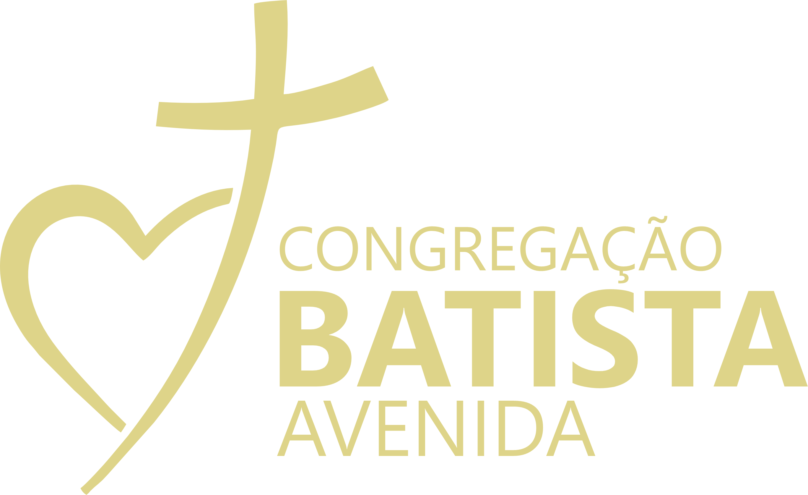
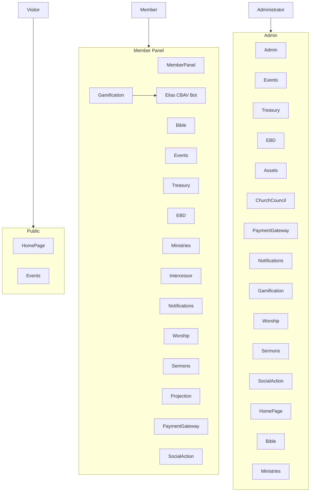

<div align="center">
  

  ### The Ultimate Intelligent Church Management Ecosystem

  [](https://laravel.com)
  [](https://tailwindcss.com)
  [](LICENSE)
  [](https://github.com/RabbitVisual)

  *Empowering modern ministry through high-performance software engineering and faith.*
</div>

---

## Executive Summary

**VertexCBAV** is a sophisticated, high-performance Church Management System (ERP). Designed with a multi-module architecture, it unifies spiritual growth and institutional governance into a single, cohesive experience. From real-time worship management to advanced biblical studies and social compassion logistics, VertexCBAV is the definitive technological arm for the modern church.

The **Member Panel** includes **Elias (CBAV Bot)** — a gospel-focused assistant that delivers contextual tips, daily reading recommendations, and page-based insights to help members grow in their journey. Elias is powered by the Gamification module and integrates with the Bible module for verse recommendations.

### Elias (CBAV Bot) in the system

Elias appears in the Member Panel as a fixed assistant at the bottom of the screen: his avatar is shown next to a speech bubble with contextual tips, daily verse recommendations, and optional links to the analysis page or guided tours. The representation below mirrors how he is shown in the product.

<table>
<tr>
<td width="120" valign="top">

</td>
<td valign="top">
<em>In the application, Elias appears with a speech bubble (left). He delivers insights by page, recommends the daily reading, and can highlight medals or next steps — keeping the experience coherent and focused on growth.</em>
</td>
</tr>
</table>

> **Note:** This project is undergoing continuous evolution (2026), with focus on gamification, member experience, and enterprise-grade consistency.

---

## Technological Stack

- **Core:** [Laravel 12](https://laravel.com) (PHP 8.2+)
- **Frontend:** [Tailwind CSS v4.1](https://tailwindcss.com) and [Alpine.js](https://alpinejs.dev) (TALL stack)
- **Database:** MySQL 8.0+
- **Payments:** Native adapters for Mercado Pago, Stripe, and PIX
- **Real-time UX:** Alpine.js and optional polling; low-infrastructure approach for live-like updates

---

## Modular Architecture

VertexCBAV is built around **18 specialized modules**:

| Module | Description |
|--------|-------------|
| **Admin** | Core administrative panel: users, roles and permissions (Spatie), global settings, audit logs, module management. |
| **Assets** | Church asset and inventory management (physical and digital resources). |
| **Bible** | Spiritual core: multiple offline Bible versions, interlinear study, Strong mappings, Hebrew/Greek support. Source of truth for all scripture-related features. |
| **ChurchCouncil** | Leadership hub: meeting agendas, minutes, decisions, and leadership history. |
| **EBD** | Vertex Academy: Sunday School management, gamified LMS with XP and levels, student tracking, Arcade Bible games. |
| **Events** | Event lifecycle: calendar, public registrations, ticketing batches, QR check-in, certificates, badges. |
| **Gamification** | Elias (CBAV Bot), levels, medals, daily reading, contextual insights by page. Gospel-focused coaching and verse recommendations. |
| **HomePage** | Public CMS: landing sections, hero carousels, testimonials, gallery, church info. |
| **Intercessor** | Prayer network: moderated requests and prayer commitments. |
| **MemberPanel** | Member dashboard: personalized home, profile, and access to all member-facing modules. |
| **Ministries** | Organizational structure: Music, Youth, Couples, and other church sectors. |
| **Notifications** | Centralized in-app alerts and notifications across modules. |
| **PaymentGateway** | Unified donations and payments: Mercado Pago, Stripe, PIX (manual/auto). |
| **Projection** | Live sanctuary media: lyrics, Bible verses, and service slides (JS-based projection). |
| **Sermons** | Media archive: video and audio preached messages with categorization. |
| **SocialAction** | Outreach hub: charity programs, Smart Pantry kits, beneficiary dignity. |
| **Treasury** | Financial ledger: bookkeeping, budgeting, campaigns, and reports. |
| **Worship** | Music and liturgy: repertoire, setlists, ChordPro, Worship Academy (chords and academy data). |

---

## System Overview (Flowchart)

The system is organized in three access layers: **Public** (unauthenticated), **Member Panel** (`/painel`), and **Admin** (`/admin`). The diagram below shows how modules attach to each layer.



---

## Project Structure

- **Application root:** Standard Laravel application (config, routes, app, resources, database).
- **Modules:** Each module lives under `Modules/<ModuleName>/` with its own `app`, `config`, `database`, `resources`, and optional `routes`, following nWidart/laravel-modules conventions.
- **Routes:** Public and auth in `routes/web.php`; admin in `routes/admin.php`; member panel in `routes/member.php`.

---

## Quick Start for Developers

### Prerequisites

- PHP 8.2+ (extensions: BCMath, Ctype, Fileinfo, JSON, Mbstring, OpenSSL, PDO, Tokenizer, XML)
- Composer and Node.js (v20+)
- MySQL 8.0+

### Installation

```bash
# 1. Clone and enter
git clone https://github.com/RabbitVisual/VertexCBAV.git && cd VertexCBAV

# 2. Back-end
composer install
cp .env.example .env && php artisan key:generate

# 3. Database
php artisan migrate --seed

# 4. Front-end
npm install && npm run build
```

Optional: run `php artisan module:list` to verify enabled modules.

---

## Vision and Leadership

**Reinan Rodrigues**
*CEO, Vertex Solutions LTDA*
Architect of **VertexCBAV** and **VERTEXSEMAGRI**.

> "Technology is our canvas; Christ is our message. We build tools that don't just manage, but edify."

### Contact

- **Website:** [Vertex Solutions](https://semagricm.com)
- **WhatsApp:** [Support](https://wa.me/5575992034656)
- **Email:** r.rordriguesjs@gmail.com

---

## License

This project is for **private use only** and is under a **proprietary license**. Redistribution, commercial use, and modification are not permitted without explicit authorization from Vertex Solutions LTDA. See [LICENSE](LICENSE) for full terms.

---

<div align="center">
  
  <br>
  © 2026 Vertex Solutions LTDA. All Rights Reserved.
  <br>
  <em>VertexCBAV: High Performance for the Higher Calling.</em>
</div>
# VS-JUBAF
Vertex Solutions LTDA, sistema pensado e voltado para a Juventude Batista Feirense pensado para auxiliar e conectar liderança juventude com a organização.
