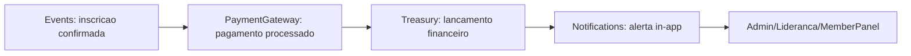

# ARCHITECTURE - Vertex JUBAF

Documento de onboarding tecnico com a visao arquitetural atual da plataforma Vertex JUBAF.

## 1. Visao geral

O sistema segue arquitetura modular Laravel, organizada por dominios de negocio. O objetivo e manter isolamento de responsabilidade por modulo e integracao por contratos de servico, eventos de dominio e rotas bem definidas.

Base tecnica:

- Laravel 12
- PHP 8.2+
- nwidart/laravel-modules
- MySQL
- Vite + Tailwind

## 2. Modulos ativos e dominios

### Core de plataforma

- `Admin`: administracao central e configuracoes.
- `MemberPanel`: experiencia autenticada do membro.
- `LiderancaPanel`: experiencia autenticada da lideranca.

### Dominio institucional

- `Igrejas`: cadastro e contexto das igrejas vinculadas.
- `Comunicacao`: feed oficial (atas, editais, avisos, noticias).
- `Diretoria`: governanca, pautas, reunioes, aprovacoes.

### Dominio operacional

- `Events`: ciclo de eventos e inscricoes.
- `Sermons`: acervo e gestao de conteudo ministerial.

### Servicos transversais

- `PaymentGateway`: processamento de pagamentos e webhooks.
- `Treasury`: registro financeiro e relatorios.
- `Notifications`: notificacoes in-app e preferencias.
- `Bible`: base biblica local e suporte a recursos devocionais.
- `HomePage`: CMS publico.

## 3. Camadas e fronteiras

### Camada de interface

- Web routes por painel:
    - `routes/web.php` (publico)
    - `routes/admin.php`
    - `routes/member.php`
    - `routes/lideranca.php`
- Views Blade e componentes por modulo.

### Camada de aplicacao

- Controllers por contexto (Admin/Member/Lideranca/API).
- Services de orquestracao por modulo.
- Policies e middleware para controle de acesso.

### Camada de dominio e dados

- Models Eloquent por modulo.
- Migrations/seeders por modulo.
- Eventos/listeners para sincronizacao entre modulos.

## 4. Fluxo chave: Eventos -> PaymentGateway -> Treasury -> Notifications

Este e o fluxo operacional mais critico para a JUBAF.



### Descricao do fluxo

1. `Events` registra a inscricao e aciona o fluxo de pagamento.
2. `PaymentGateway` processa transacao e recebe atualizacao via webhook canonico.
3. `Treasury` cria/atualiza o lancamento financeiro correspondente.
4. `Notifications` envia notificacoes para os perfis alvo.
5. Paineis (`Admin`, `LiderancaPanel`, `MemberPanel`) refletem o estado atualizado.

### Regras arquiteturais do fluxo

- idempotencia em listeners para evitar duplicidade financeira;
- `PaymentGateway` como unica porta de entrada de pagamentos;
- `Treasury` como fonte de verdade contabil;
- notificacoes disparadas por evento confirmado, nao por tentativa.

## 5. Integracoes internas relevantes

- `Events` <-> `PaymentGateway`: criacao e atualizacao de transacoes.
- `PaymentGateway` -> `Treasury`: consolidacao financeira.
- `Treasury` -> `Notifications`: comunicacao de eventos financeiros.
- `Diretoria` <-> `LiderancaPanel`: governanca e decisao.
- `Comunicacao` -> todos os paineis: comunicados oficiais segmentados.

## 6. Convencoes tecnicas

- Nome oficial de dominio/painel: `Lideranca` (evitar termos legados).
- Respeitar namespace por modulo: `Modules\\<Modulo>\\...`.
- Evitar dependencia circular entre modulos.
- Priorizar services para regras complexas (controllers finos).
- Sempre validar impacto em rotas e autoload apos refatoracao.

## 7. Checklist de validacao apos mudancas estruturais

```bash
composer dump-autoload
php artisan optimize:clear
php artisan route:list
```

Opcional (quando aplicavel):

```bash
php artisan test
```

## 8. Riscos conhecidos e mitigacao

- **Risco:** referencia residual a namespace/pasta antiga.
    - **Mitigacao:** busca global e validacao de autoload.
- **Risco:** regressao no fluxo financeiro de eventos.
    - **Mitigacao:** testes de integracao por cenario de confirmacao de pagamento.
- **Risco:** divergencia entre documentacao e estado real.
    - **Mitigacao:** atualizar este arquivo a cada fase relevante.

## 9. Proximos passos arquiteturais

- Formalizar contratos de eventos entre `Events`, `PaymentGateway`, `Treasury` e `Notifications`.
- Publicar diagrama de sequencia detalhado do checkout de eventos.
- Criar matriz de permissao por perfil (`Admin`, `Lideranca`, `Membro`).
